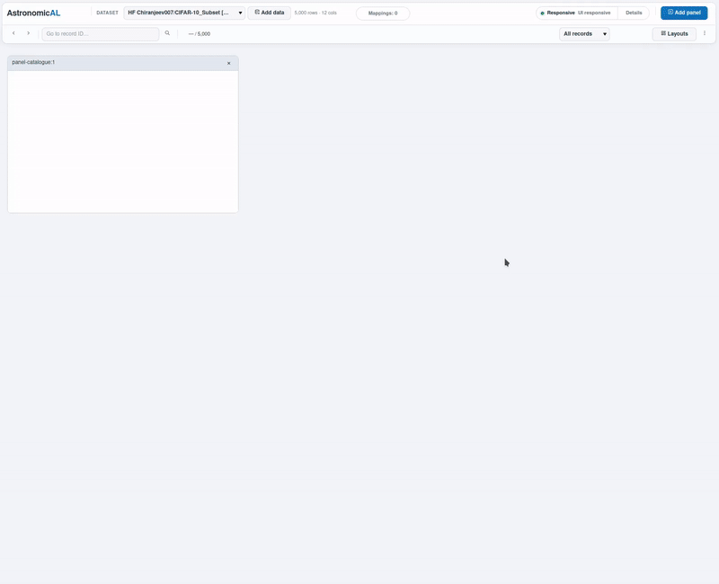
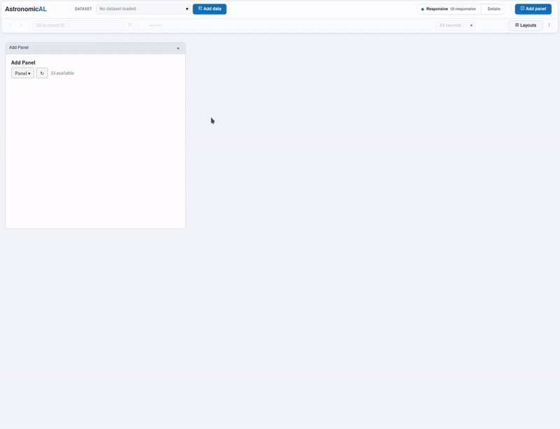
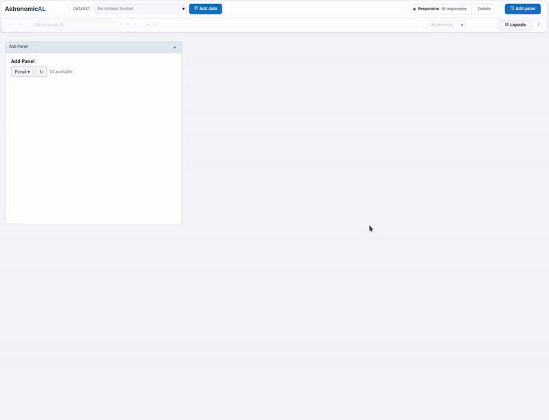

# AstronomicAL

[](https://astronomical.readthedocs.io/en/latest/?badge=latest)
## An interactive, plugin-based platform for exploring, labelling, integrating, and modelling scientific data

AstronomicAL is a local, human-in-the-loop workspace that brings data exploration, domain-specific inspection, annotation, and machine learning together in a single interactive application.

Rather than prescribing one fixed workflow, AstronomicAL is built around plugins. Users can combine general-purpose tools with domain-specific capabilities to create a workspace around the problem they are trying to solve. This can include plugins from astronomical source inspection to image classification and active learning.

<h2>See AstronomicAL in action</h2>

<p>
Four example workflows showing how AstronomicAL combines plugins for scientific exploration, domain-specific analysis, data import, and machine learning. Click any preview to open the full-quality MP4 recording.
</p>

<table width="100%">
  <tr>
    <td width="50%" align="center">
      <a href="assets/machine_learning_shorter.mp4">
        
      </a>
      <br>
      <strong>Machine Learning</strong>
    </td>
    <td width="50%" align="center">
      <a href="assets/huggingface_cifar10_short.mp4">
        
      </a>
      <br>
      <strong>Hugging Face Importer</strong>
    </td>
  </tr>
  <tr>
    <td width="50%" align="center">
      <a href="assets/spec_to_phot_shorter.mp4">
        
      </a>
      <br>
      <strong>Spectroscopy and Photometry</strong>
    </td>
    <td width="50%" align="center">
      <a href="assets/morphology_shorter.mp4">
        
      </a>
      <br>
      <strong>Morphology</strong>
    </td>
  </tr>
</table>


AstronomicAL was originally developed for active learning with large astronomical catalogues. The same underlying challenges appear far beyond astronomy: datasets can be too large to inspect manually, reliable labels can be expensive to obtain, difficult examples require expert judgement, and useful decisions often depend on information spread across several different tools or data sources.

The current version of AstronomicAL keeps those original human-in-the-loop and active-learning goals while generalising the application into an extensible platform. Astronomy remains a first-class use case, but it is now provided through the same plugin system that can support other scientific and data-intensive domains.

---

## What can AstronomicAL do?

AstronomicAL provides a shared interactive workspace in which plugins can work together around the same dataset and selection state. Depending on the plugins installed, a workflow can combine catalogue data, plots, images, spectra, annotations, external services, derived products, and machine-learning models without requiring every capability to be built into the core application.

Current functionality includes:

* **Interactive data exploration** — browse records, inspect columns, create plots, filter data, and move between individual sources or selected subsets.
* **Domain-specific inspection** — open specialised tools alongside generic panels. Astronomy plugins can, for example, retrieve and inspect spectra, photometry, images, SEDs, or external survey products.
* **Annotation and review** — attach labels, notes, review states, and other expert judgements to records while retaining the context needed to make those decisions reliably.
* **Machine learning** — configure, train, evaluate, and apply models from within the workspace, with long-running operations handled without blocking the interface.
* **Active learning** — use model predictions and uncertainty to focus expert attention on informative examples instead of labelling an entire dataset manually.
* **Dataset import and transformation** — work with local tabular data and extend the platform with importers for other sources, including dataset services such as Hugging Face.
* **Reusable derived products** — allow one plugin to produce model scores, selections, spectra, cutouts, reports, or other results that can be consumed by another plugin.
* **Persistent workspaces** — compose panels around a task and restore supported workspace and plugin state between sessions.

The result is intended to feel less like a collection of disconnected scripts and more like a research workspace: selecting or updating an object in one part of AstronomicAL can immediately provide the context required by the other tools in the workflow.

---

## A plugin-based platform

Earlier versions of AstronomicAL included most functionality directly in the main application. This worked well for the original astronomy and active-learning workflows, but it also meant that adding a new domain, service, visualisation, or workflow increased the size and complexity of the core application for every user.

AstronomicAL is now organised around a deliberately small platform and a collection of plugins.

The platform provides the common infrastructure required by interactive workflows: datasets, selections, background jobs, derived artifacts, events, services, workspace management, and persistence. Plugins provide the behaviour users interact with.

A plugin can contribute panels, actions, services, artifact viewers, workflows, importers, or domain-specific integrations. This makes it possible to keep the base application generic while installing only the capabilities needed for a particular project.

In practice, this means the same AstronomicAL installation can support very different tasks. An astronomer might combine catalogue browsing with spectroscopy and photometry plugins; another user might import an image dataset, inspect examples, and build a classifier; a project can also add its own local plugin without modifying the platform itself.

Core functionality is implemented using the same plugin model so that the extension mechanism is not reserved only for third-party code. The aim is for new features to integrate through shared platform contracts rather than through direct coupling between panels.

We are actively developing a plugin marketplace that will allow users to create and share domain-specific plugins, and discover and install plugins directly from within AstronomicAL.

---

## Statement of need

Modern scientific datasets are increasingly large, heterogeneous, and difficult to inspect exhaustively. At the same time, supervised machine-learning systems depend heavily on the quality of the data used to train them. Missing labels, inconsistent classifications, rare classes, ambiguous examples, and incorrect ground truth can all limit model performance.

Active learning provides one way to reduce this burden by asking an expert to label the examples expected to be most informative to the model. This can dramatically reduce the amount of manual labelling required, but the usefulness of the process depends on the expert having enough context to make a reliable decision.

That need for context motivated AstronomicAL from the beginning. A catalogue row alone is often not enough: an astronomer may need images, spectra, colours, existing classifications, external archive information, and neighbouring sources before deciding what an object is. Equivalent problems occur in many other domains where human judgement remains essential.

AstronomicAL brings those pieces into one coordinated workspace. The plugin system extends that original idea by allowing the inspection tools to change with the domain while the underlying workflow — explore, inspect, select, annotate, model, review, and repeat — remains reusable.

The application runs locally, allowing users to keep control of their datasets while integrating remote services only where a workflow requires them.

---

## Installation

AstronomicAL is currently under active development. For the latest development version, clone the repository and install it inside an isolated Python environment.

Clone the repository and enter the project directory:

```bash
git clone https://github.com/grant-m-s/AstronomicAL.git
cd AstronomicAL
```

Create and activate a virtual environment:

```bash
python -m venv venv
source venv/bin/activate
```

Using Conda is also supported:

```bash
conda create -n astronomical python
conda activate astronomical
```

Install the core dependencies:

```bash
pip install -r requirements-core.txt
```

Additional requirement sets are available for specific functionality:

* `requirements-astro.txt`
* `requirements-huggingface.txt`
* `requirements-ml.txt`
* `requirements-dev.txt`

Install any additional set as required:

```bash
pip install -r requirements-astro.txt
```

Or install all available dependencies at once:

```bash
pip install -r requirements-all.txt
```

Using an isolated environment is strongly recommended so that AstronomicAL and its plugin dependencies remain separate from other Python projects on the system.

### Running AstronomicAL

Start the application with:

```bash
panel serve astronomicAL --show
```

Panel should open AstronomicAL automatically in your browser. If it does not, open the local address printed in the terminal.

Once running, datasets can be loaded into the workspace and additional capabilities can be opened from the available plugins. Plugins may define their own requirements, mappings, services, or optional Python dependencies depending on the workflow they provide.

---


## Contributing to AstronomicAL

Contributions, bug reports, feature ideas, documentation improvements, and new plugins are welcome.

### Reporting bugs

If you encounter a problem, open an issue and include enough information to reproduce it. Useful details include the steps taken, expected and actual behaviour, relevant logs or tracebacks, the dataset format where appropriate, and the plugins involved in the workflow.

### Contributing code and plugins

Pull requests can improve the platform itself, migrate existing functionality into the plugin architecture, add tests and documentation, or introduce new generic, workflow, and domain plugins.

When contributing a plugin, it should use the shared AstronomicAL platform services rather than relying on direct communication with another panel. This keeps plugins independently installable, removable, testable, and reusable in different workspace combinations.

---

## Referencing AstronomicAL

If AstronomicAL supports your research, please cite the project and the original software paper. Citation information is available in the project documentation and repository citation metadata.

AstronomicAL was originally developed and validated using astronomical datasets, and the original publication describes the motivation and active-learning workflow that formed the basis of the project. The plugin-based platform builds on that work while making the same interactive, human-in-the-loop approach available to a broader range of workflows and domains.
