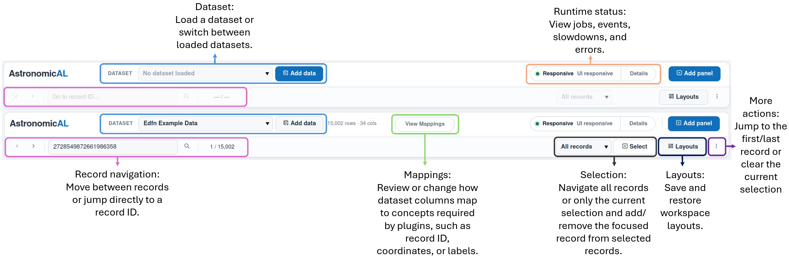

Tour of the Interface
=====================

The Application Header
----------------------

AstronomicAL uses two fixed rows of application controls.

The top header contains:

* the active dataset, dataset dimensions and **Add data** control;
* the mapping-status control for the active dataset;
* the runtime health indicator and **Details** view;
* **Add panel** for opening the panel catalogue.

The second toolbar contains record navigation, exact record-ID search, the
current record position, dataset or selection navigation scope, selection
membership controls and the **Layouts** menu.

The overflow menu also provides first/last-record navigation, selection
clearing and a shortcut to Record Browser.

The Workspace
-------------

The centre of the application is a responsive grid of panel instances. Panels
can be opened, resized, moved and closed independently.

Opening the same registered plugin panel again creates a separate workspace
instance with its own instance ID and, where supported, its own persisted state.

The Panel Catalogue
-------------------

Pressing **Add panel** opens a temporary **Add Panel** menu inside the
workspace. It lists panel registrations currently provided by enabled plugins.

The catalogue itself is a platform panel and is not included when the workspace
is saved.

Focus and Selection
-------------------

The focused record is the single row currently being inspected. The active
selection is a separate set of record IDs that can be used as a navigation
scope or shared between linked panels.

.. caution::

   Changing focus does not replace the active selection set. Creating a new
   selection can move focus to its first row when the previous focus is not
   already part of that selection.

Jobs and Runtime Status
-----------------------

The header runtime indicator distinguishes normal background work from UI lag,
slow synchronous event callbacks and recent failures.

Press **Details** to inspect active jobs and event publishes, recent jobs,
callback errors, runtime messages, event performance and recorded interface
lag. This view is diagnostic and does not cancel or modify jobs.

Layouts
-------

The **Layouts** menu contains quick workspace templates together with commands
to quick-save, save as and load workspace files.

A saved workspace contains plugin and dataset snapshots, focus and selection
state, persistent panel instances and their JSON-safe state, and responsive grid
geometry. Temporary panels such as **Add Panel**, running jobs and live service
objects are not stored as panel state.