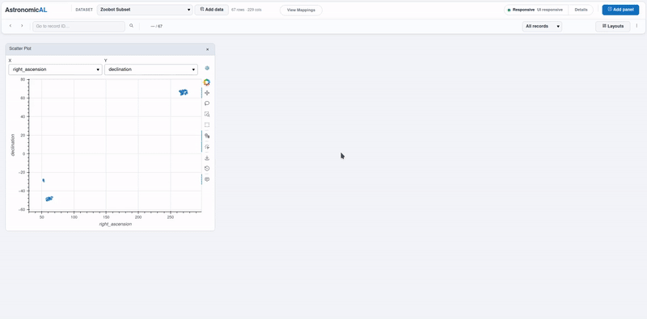
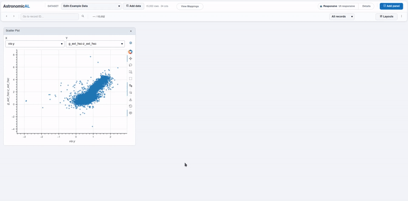

Visualisation
=============

Overview
--------

:code:`core.visualisation` provides linked scatter, histogram and density views
for the active dataset. It combines HoloViews and Datashader rendering with
bounded interactive data access so large datasets can still participate in
focus and selection workflows.

What You Do
-----------

1. Open a standalone plot or the combined **Linked Plot Explorer**.
2. Choose the X and Y columns and, where useful, a colour or grouping column.
3. Inspect numeric, datetime or categorical structure in the active dataset.
4. Tap a scatter point to focus one record.
5. Use box or lasso selection in the scatter view to create a selection set.
6. Open Record Browser, Image, Spectra, SED or Selection Tools to inspect the
   same focus and selection.
7. Save the workspace to restore the chosen plot settings later.

.. TODO: Add a GIF showing scatter focus, lasso selection and linked panels.

Required Mappings
-----------------

* :code:`record_id`

No label mapping is required. If a :code:`target_label` mapping exists it can be
used as the default colour or grouping column, but any supported dataset column
can be selected instead.

Panels
------

Scatter Plot
************

The **Scatter Plot** supports configurable X and Y columns, optional categorical
or continuous colouring, sampled interactive rendering and Datashader fallback
for large datasets.

Tapping a point changes focus. Box and lasso tools create selection sets, with
the maximum number of published row IDs controlled by the panel settings.

Histogram Plot
**************

The **Histogram Plot** displays the selected X variable and can split the
distribution by a categorical colour column. It supports configurable bins,
value limits, percentage or cumulative display, logarithmic axes and an overlay
for the focused row.

Categorical X values are represented as discrete histogram bins.

Density Plot
************

The **Density Plot** provides a two-dimensional density view for the selected X
and Y columns. It supports interactive or rasterised rendering, configurable
density bins, axis limits and logarithmic axes.

The focused row can be shown on top of the density result without turning every
source row into an interactive point.

Linked Plot Explorer
********************

The **Linked Plot Explorer** places scatter, histogram and density views in tabs
behind one shared settings header. Axis, colour, filtering and rendering changes
are shared between its three child views.

Standalone plot instances use their own visualisation state and remain
independent of one another.

Focus and Selection
-------------------

Focus and selection are separate platform states. A scatter tap normally changes
**focus**, which identifies one record. Box or lasso interaction creates a
**selection**, which contains a set of record IDs.

The plugin uses the platform SelectionManager rather than directly updating
other panels, so linked plugins can react to the same focus and selection.

Large Datasets
--------------

Scatter and density views can switch to Datashader when the dataset exceeds the
configured rendering threshold. Interactive scatter mode uses a bounded sample
for browser-level point interaction while retaining the larger-data context.

Shared prepared-frame, column, row-ID and focused-row caches reduce repeated
source reads across related visualisations. Focused rows can also be resolved
asynchronously through the platform job system when a direct lookup would be
too expensive for the UI thread.

Axis Types
----------

Plot axes support scalar numeric, datetime and categorical values. Numeric-like
and datetime-like strings are converted when they can be interpreted reliably;
remaining scalar values are factor encoded for categorical display.

Array, struct, map, binary and similar non-scalar columns are excluded from the
normal axis choices.

Saved State
-----------

Axis choices, colour and filtering settings, render mode, sampling limits,
point appearance, histogram and density settings and supported axis limits are
stored with each panel instance.

The **Linked Plot Explorer** stores one shared state for its child views.
Standalone plot panels restore their own state independently.

.. note::

   Rasterised pixels describe aggregate density rather than individually
   selectable records. Use the scatter interaction layer when precise focus or
   row-set selection is required.