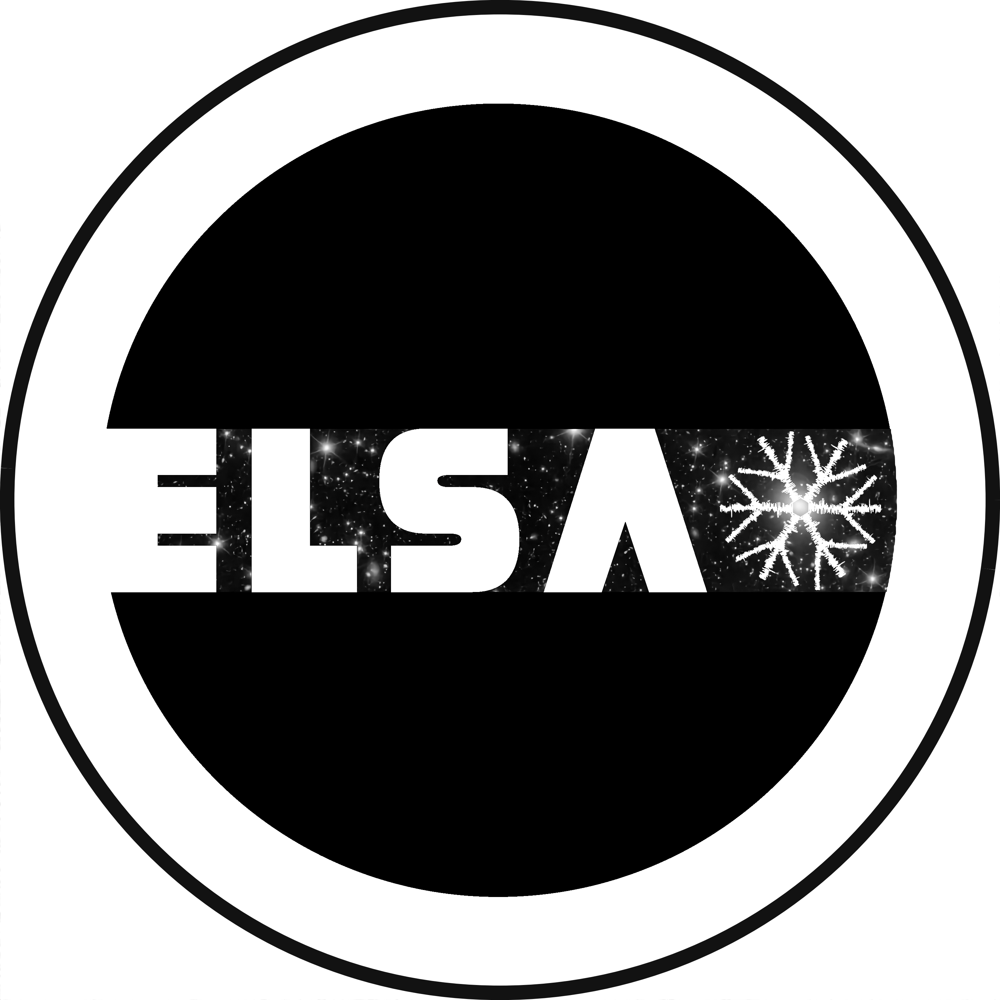

Contributors
========================

Developers
------------------------

Core Development
**********************

* `Grant Stevens <https://research-information.bris.ac.uk/en/persons/grant-stevens>`_

Domain-Specific Development
*****************************

* `Ivano Saccheo <https://research-information.bris.ac.uk/en/persons/ivano-saccheo>`_

Technical Advisors
**********************

* `Sotiria Fotopoulou <https://research-information.bris.ac.uk/en/persons/sotiria-fotopoulou>`_
* `Malcolm Bremer <https://research-information.bris.ac.uk/en/persons/malcolm-n-bremer>`_
* `Oliver Ray <https://research-information.bris.ac.uk/en/persons/oliver-ray>`_

.. _funding:

Funding
-------------------------

Grant Stevens acknowledges financial support from the `UKRI`_ for an EPSRC Doctoral Prize Fellowship at the `University of Bristol`_ (EP/W524414/1), as well as funding for an `Interactive AI Centre for Doctoral Training`_ studentship.

.. image:: ../../_static/images/EPSRC_logo.png
   :width: 56%
   :target: https://gtr.ukri.org/projects?ref=studentship-2466020

.. raw:: html

 

The Euclid-specific plugins were developed within the `ELSA`_ project with grant agreement number 101135203 funded by the European Union. Views and opinions expressed are, however,
those of the authors only and do not necessarily reflect those of the European 
Union or Innovate UK. Neither the European Union nor the granting authority can be held responsible for them. UK participation is funded through the UK Horizon guarantee scheme under Innovate UK grant 10093177.

Referencing the Package
-------------------------

Please see the :ref:`citing <citing>` page for instructions about referencing and citing the AstronomicAL software.

.. _`University of Bristol`: https://www.bristol.ac.uk/
.. _`UKRI`: https://gtr.ukri.org/projects?ref=studentship-2466020
.. _`Interactive AI Centre for Doctoral Training`: http://www.bristol.ac.uk/cdt/interactive-ai/
.. _`ELSA`: https://elsa-euclid.github.io/
