.. _active-learning:
Training a Classifier
=======================================================

Creating an Active Learning-based Classifier
---------------------------------------------

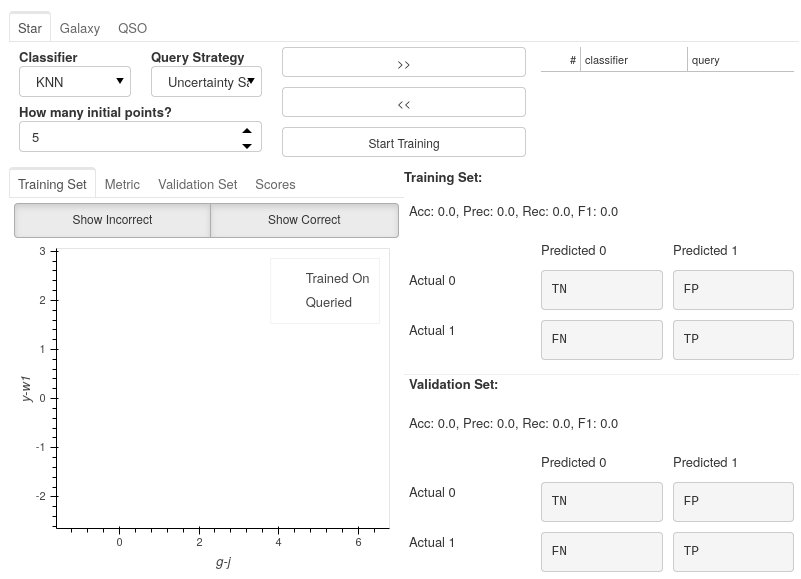

The Active Learning Dashboard is arranged in two sets of tabs:

  1. A Tab for each label classifier you chose in the previous settings will encapsulate everything you need to know about that particular one-vs-rest classifier.

  2. Inside each classifier tab, you have a set of tabs showing different plots related to how the classifier performs.

In this example, we will only be using the :code:`Star` tab as we are only training the Star classifier, but the same steps will apply for each classifier you choose to train.

.. raw:: html

   

Choosing your model
****************************************

For each classifier tab, you can assign which classifiers you want to use for the active learning process.

.. image:: ../../images/training_tutorial_AL_1.png

.. raw:: html

   

Choosing a Query strategy
**************************************

The main idea of Active Learning is that instead of piling as much data as possible onto a model to train on, you can get equal or better performance with substantially less data if you analytically choose the most informative data points according to a metric. The query strategy *is* that metric.

Each classifier that you select is paired with your chosen query strategy.

In this run, we are using a Random Forest classifier with an Uncertainty Sampling query strategy.

.. image:: ../../images/training_tutorial_AL_4.png

.. raw:: html

   

Creating a Committee
*****************************
Even though we have only used a single classifier in this example, you are not restricted to only one. You can use any number of classifiers for your model, leading to an ensemble of classifiers known as a committee in Active Learning.

If you choose to create a committee, each classifier will have to retrain at each iteration of Active Learning, increasing the waiting times between queries.

When using a committee, whenever the model is saved, rather than being a single file for the classifier, it is saved as a folder of classifier files, which would need to continue being used together as an ensemble.

.. note::

	When adding multiple classifiers, you will still add a different query strategy for each; however, these are not used during training. Instead, the query strategy becomes the *vote entropy*, where the most informative point is the one that has the most significant disagreement between classifiers.

.. raw:: html

   

How Many Initial Points?
***************************
.. image:: ../../images/training_tutorial_AL_2.png
  :align: center

The final decision is to choose how many initial points to start the training process with. These points are chosen randomly, so choosing a high number may negatively impact Active Learning effectiveness and may reduce the maximum possible performance of your model. However, you will likely reduce the time spent on training and labelling.

Choosing a low number has the benefit that at the point you stop training, the majority of the points accumulated in your model's training set will have been selected based on their informativeness. However, to get good performance, you will have to hand-label more points which could become time-consuming.

.. raw:: html

   

.. image:: ../../images/training_tutorial_AL_5.png

Here is the final setup for our Star classifier.

Let the training begin!
-------------------------------------

Immediately after confirming the classifier settings, your model will begin training on some randomly selected points; how many is determined by the number you set in the previous section.

The First Results
***************************

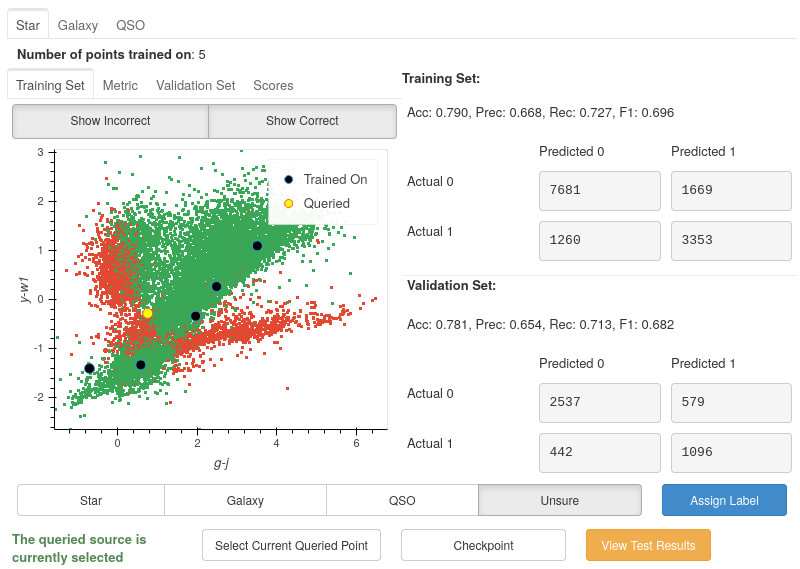

Once trained, you will be presented with a colourful plot showing all your training data, with the axes specified in your :code:`default_x_variable` and :code:`default_y_variable` parameters from :ref:`settings <choosing-default-axis-variables>`. All the green points are your model's correct predictions, and red is your incorrect predictions. The blue dots are the five randomly chosen initial points, and the yellow point is the most informative data point based on the chosen classifier and query strategy.

Good Results, Bad Predictions
~~~~~~~~~~~~~~~~~~~~~~~~~~~~~~
At first glance, it seems like the model is performing pretty well: nearly 80% accuracy in both training and validation sets using only 5 points! However, these results may be deceiving.

The split between Stars and non-Stars here is roughly 33:66. Due to this imbalance, the classifier may develop a preference for predicting non-Star. However, one of the benefits of active learning is that by training on smaller amounts of data, it becomes easier to avoid the adverse effects of imbalanced datasets.

If we look at the correct and incorrect predictions (green and red areas), we see that the points from bottom left to top right look almost all correct. However, this is a very dense area, meaning that they may be overwhelmed by correct predictions if there are incorrect predictions (or vice-versa). To check how many incorrect points are actually there, we can hide the correct points by toggling off the :code:`Show Correct` button.

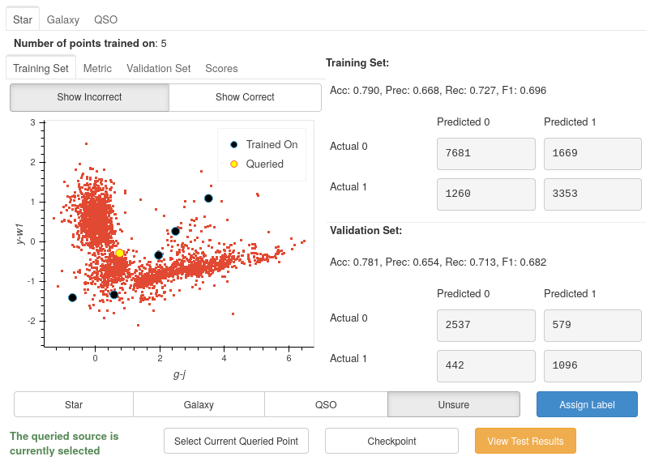

After removing the correct points, it is much easier to see only a couple of incorrect points are in the centre region. It is even more apparent now that the problem lies in the two *branches* appearing from the bottom right.

The Labelling Process
-------------------------------------

We will need to add some more labelled data for the model to train on to improve our results across all metrics. However, we know very little about the current queried point and cannot make a confident classification without more information about the source.

So let's get more information about the source.

Exploring each source
***************************

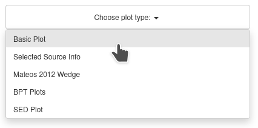

Throughout the UI, you will have already noticed several **Choose plot type** panels. This is where the user can see more about each source at one time than would typically be possible.

Selected Source Information
~~~~~~~~~~~~~~~~~~~~~~~~~~~~~~

One of the available plots is the :code:`Selected Source Information`, which is more of a mini dashboard than a plot, but it allows us to see critical information about the selected source.

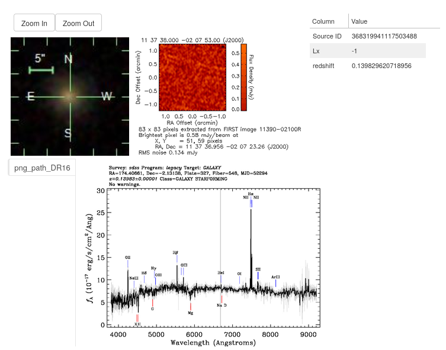

As you can see, we now get the crucial information required to make a confident classification of the source.

By default, the Optical and Radio images of the source are pulled from the SDSS_ and FIRST_ cutout services, respectively. These are provided free to the user as all that is required is the source's location (RA and Dec columns). Given that area of the sky has been sampled, the images will be provided. (If you do not have these columns or are not using an astronomical dataset, these images will not be shown)

.. _SDSS: http://skyserver.sdss.org/dr16/en/help/docs/api.aspx#imgcutout
.. _FIRST: https://third.ucllnl.org/cgi-bin/firstcutout

We also see the two columns we specified in the settings earlier and the ID of the datapoint.

Sometimes, however, even this information may not be enough, and that is where the other plots are extremely useful.

The Basic Plot
~~~~~~~~~~~~~~~~~~~~~~~~~~~~~~

The basic plot allows you to choose any :code:`X` and :code:`Y` axes from all the columns in your original file, as well as the additional features you created earlier.

When you first load the basic plot, the axes displayed will be your specified :code:`default_x_variable` and :code:`default_y_variable`, along with the colours you chose at the beginning for each label. As these are the same axes displayed in the Active Learning panel, we can now take a more detailed look at where things are going wrong.

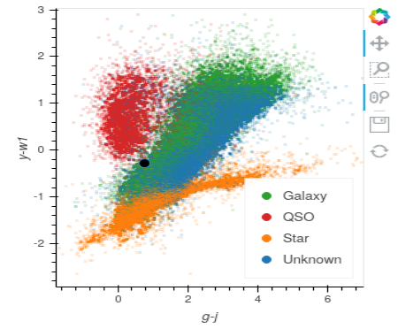

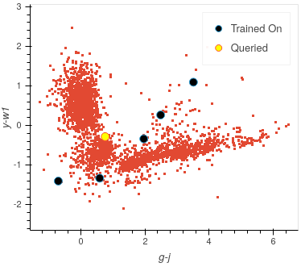

It is now much more apparent why we have the two branches of incorrect values. The branch trailing off the right are majoritively Stars, whereas the centre regions of majoritively Galaxies. The classifier is likely using the labels from the three trained on centre points (which will be labelled as non-Star as this is a one-vs-rest classifier) and labelling the Stars as non-Stars.

The branch on the left, which, as you approach the top half of the plot, are majoritively QSOs, is being classed as Stars. This is likely due to no QSOs being included in the classifier yet, leading it to view Stars as its closest match. Once a point is queried in that area and labelled as a non-Star, a large amount of those red points will likely turn green.

.. raw:: html

   

Let's look at some of the other generated features and see if they can separate the data.

.. image:: ../../images/training_tutorial_AL_12.png
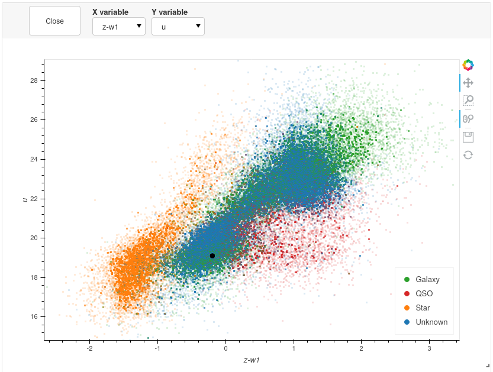

All plots are rendered using Bokeh_ and optimised using Datashader_, enabling you to plot millions of points at once whilst still remaining responsive.

.. _Datashader: http://holoviews.org/user_guide/Large_Data.html
.. _Bokeh: https://docs.bokeh.org/en/latest/index.html

.. image:: ../../images/basic_plot_interactive.gif

.. raw:: html

   

Once again, we can see clear clustering between the sets of objects; however, the overlapping boundary is potentially still problematic. Taking all the information into consideration, we can assign this point the Galaxy label and continue training.

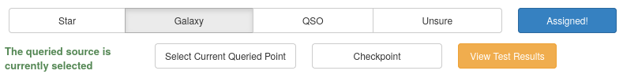

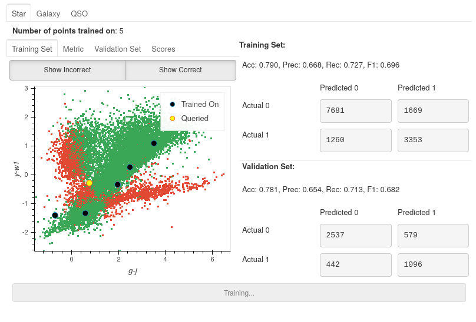

.. raw:: html

   

The model has now been retrained with the addition of the extra Galaxy, and now a new *most informative* point has been queried.

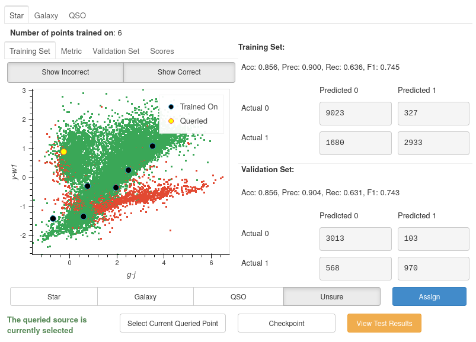

As you can see, the left branch of incorrect points has been largely reduced, and so our accuracy has increased up to 86% for both training and validation.

Analysing the Performance Scores
-------------------------------------

Performance Metrics
***************************

If you look at the score for this iteration, you can see that although accuracy, precision and F1-score increased, recall dropped by nearly 0.1. Is this something we should worry about?

Let's first begin with the definition for each of the metrics:

.. math::

    Precision = \frac{TP}{TP+FP}

.. math::

    Recall = \frac{TP}{TP+FN}

.. math::

    F1 Score = \frac{2 * Precision * Recall}{Precision+Recall}

Where TP is True Positives, FP is False Positives, and FN is False Negatives.

If we look at the change in precision, an increase of nearly 0.25 shows that the classifier is better at labelling only Stars as Stars. Unfortunately, the drop in recall shows that we are now misclassifying more Stars than before. Pair these with the increase in accuracy, which indicates that we are predicting more points to be non-Stars overall, and due to the higher number of non-Stars, this leads us to predict more points correctly. This is confirmed when we view the confusion matrices where the bottom right (TP) has decreased, whereas the sum of the left-hand columns (Predicted 0) has increased by around 2000 points.

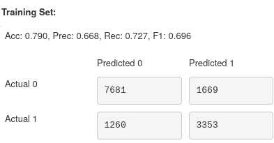

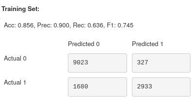

.. raw:: html

   

Checking Training Progress
********************************

Now is a good time to look at the rest of the plots available to us within the Active Learning panel.

Training Set Plot
~~~~~~~~~~~~~~~~~~~~~~~~~~~~~

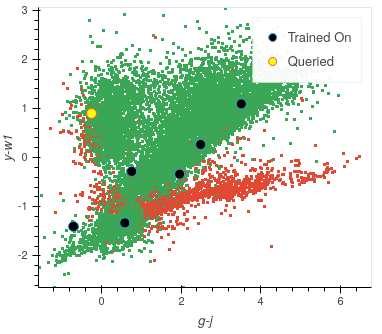

As we have seen already, in this plot, we seen all the data within our training set, plotted according to whether our current model has predicted correctly. We also see which points the model has so far trained on and also the queried point which would provide the most information to the model if it was labelled.

.. note::

	It is easy to get confused by the difference between the **training set** and the **points the model has trained on**.

  To clarify:

    **training set** = **training pool** + **points the model has trained on**

  Where the **training pool** are all the points the model gets to choose from when querying its next source.

.. raw:: html

   

Metric Plot
~~~~~~~~~~~~~~~~~~~~~~~~~~~~~

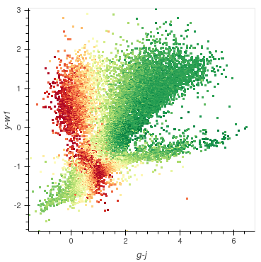

Arguably the most interesting of the plots to look at is the metric plot, which is a visualisation of the query strategy and the driver for the active learning process. As we are using **Uncertainty Sampling**, this visualises the certainty the model has in its prediction. Green means the model is very confident in its prediction; Red means it's very unsure and can't decide whether the source is a Star or Galaxy.

.. caution::

	It is important to note that it will, at times, look as though the areas of high uncertainty match the areas of incorrect predictions from the model. However, with the query strategies we are using, the Active Learning query process completely ignores which label the model assigns to a source and therefore is not affected by correctness.

  It is easy to misunderstand this as *Active Learning improves your model's accuracy* when all it is doing is reducing the uncertainty of the most uncertain point at that particular iteration. It just so happens that for many cases, the accuracy and other performance scores increase as a byproduct.

.. raw:: html

   

Validation Set Plot
~~~~~~~~~~~~~~~~~~~~~~~~~~~~~

Next, we have the validation set plot, which is plotted according to its correctness, just like the training set plot.

The plot looks less densely packed because it is only 20% of the original dataset, whereas the training set is 60% of the original dataset.

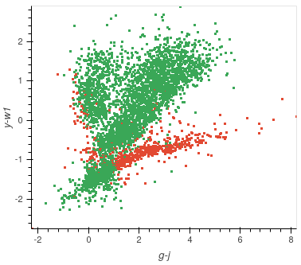

.. raw:: html

   

Score Tracking Plot
~~~~~~~~~~~~~~~~~~~~~~~~~~~~~

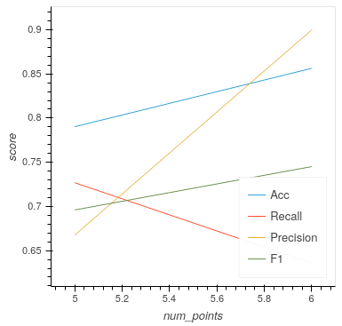

The score tracking plot does exactly that - tracks scores. This is useful for seeing the overall trend of your models improvement. As is commonly the case, you may start to notice your scores make smaller and smaller gains as more labelled data are added to the model, eventually leading to a near flat line over multiple iterations. Although there aren't specific stopping criteria for active learning, having your scores converge in this way with no changes in performance as you add more data, might be a good time to stop.

.. raw:: html

   

It's OK to be Unsure
-------------------------------------

As you query more points, there will inevitable be a time when you are presented with a point that is inconclusive. This may be caused by certain features giving conflicting results, or just that a particular source is missing too much key information for you to assign a confident and justifiable label.

Given that the model is likely to be training on such a small amount of data, it is not worth risking a potential incorrect label that *may* dramatically affect our models' performance.

By labelling a point as unsure it removes this point from the training set, and then re-queries the training pool for the next most informative source.

No harm done!

Seeing the Results
-----------------------------

Training a little further (up to 20 points), let's see how our Star classifier has performed.

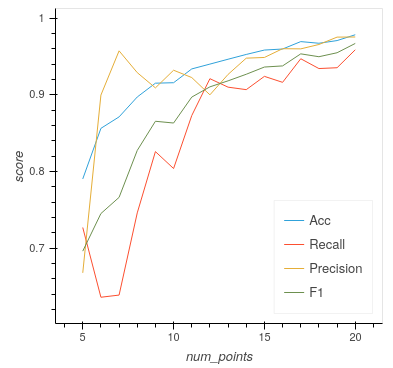

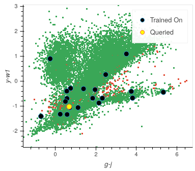

As you can see, the performance overall continues to improve. There are occasional drops, likely due to a queried point being in a part of the search space that has yet to be explored and causing local points to change label abruptly; however, they bounce back almost immediately.

Saving your model
----------------------------

Now that the model has reached a suitable performance for us to apply it to new and unseen data, it is important that we save it for reusability and portability.

Well, the good news is that after each iteration of active learning, astronomicAL automatically saves a copy of your model inside the :code:`models/` directory in the form :code:`label-Classifier_QueryStrategy.joblib`. This gets overwritten at each iteration, so it is always the most up-to-date. However, when you require something more permanent, you can use the :code:`Checkpoint` button.

.. image:: ../../images/training_tutorial_AL_28.png

This can be pressed once per iteration and will save your current model in the form :code:`label-Classifier_QueryStrategy-iteration-validationF1score-YYYYMMDD_HH:MM:SS.joblib`
to allow you to choose your best performing or most recent model quickly.

What About The Other Classifiers?
----------------------------------

In this example, we only made use of the Star classifier; well, what about the Galaxy classifier?

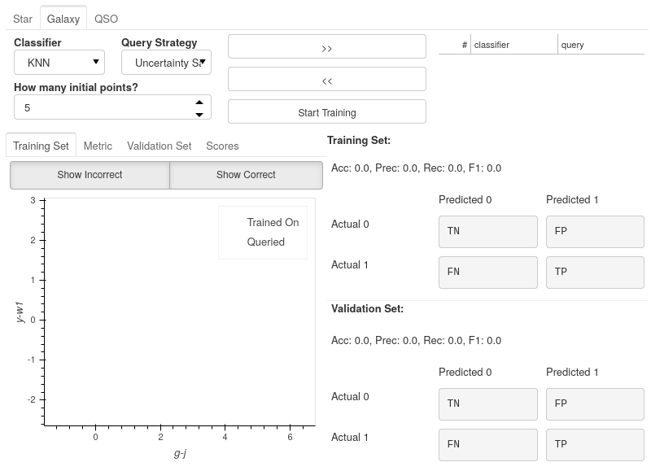

As you can see, each classifier tab is independent of the others, allowing you to tailor each classifier for each label. The workflow for training multiple classifiers is down to preference. You could focus on a single classifier until you are happy with its performance, then move on to the next, or you could assign a label for a source on one classifier, then switch over tabs and label a source on one of the other classifiers, each will produce the same results.

.. raw:: html

   

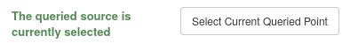

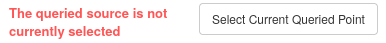

If you lose track of which tab the selected source is from it is always shown at the bottom of each classifier tab whether the selected point is that classifiers queried point. If it is not the currently selected point you can simply select the :code:`Show Queried` button to reselect the current classifier's queried point.
