Training a Classifier: From Start to Finish
=======================================================

In this tutorial we will go through the process of training a star classifier using astronomicAL.

Completing the data setup
-----------------------------------

Loading a Fits File
***********************

The first step for the user is to load in a dataset from a fits file. All fits files location with the :code:`data` directory will be selectable. To begin with we are going to load in the :code:`test_data_cpz.fits` file.

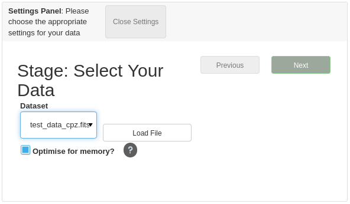
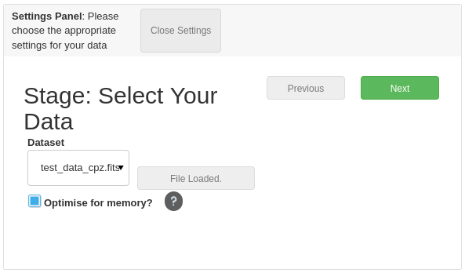

As can be seen above, the green Next button appears after the file has finished loading.

.. note::
  The **Optimise for memory** option allows the user to reduce the overall memory consumption of the dataset, however, this will increase the time it takes to load in the fits file and will delay the user from progressing to the next stage. The more columns you have in your dataset the bigger the overall improvement on memory, but also results in the longest loading times.

Assigning Parameters
**********************

To make astronomicAL as accessible as possible, there are very few requirements on columns. Where there are requirements, the user can specify their corresponding column in the following dropdowns.

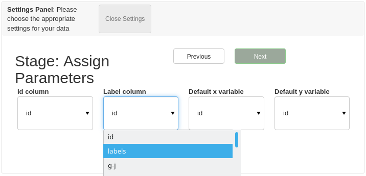

When the user chooses their labels column, the UI will autofill extra options for each unique label.

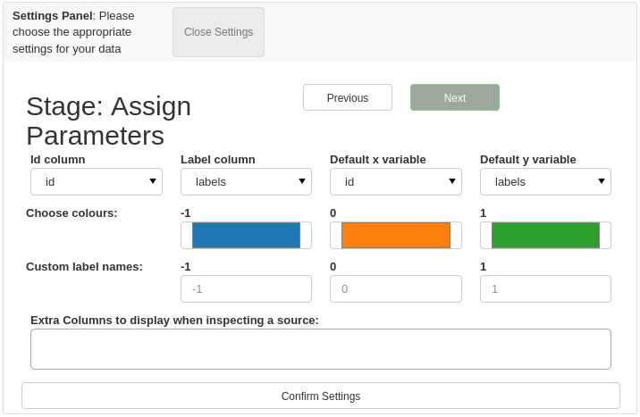

Each label can have a unique colour assigned as well as a custom string identifier, all of which will be used throughout the rest of the UI.

.. .. image:: ../../images/training_tutorial_settings_assign_params_4.png
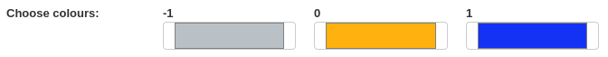
.. .. image:: ../../images/training_tutorial_settings_assign_params_6.png
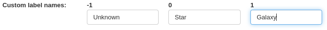

For this classification task we have assigned Star, Galaxy and Unknown labels.

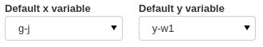

Next we must assign the default x and y axis variables. The columns chosen will become our default axes for many of the Active Learning plots as well as being the opening axes in the :code:`basic plot`.

.. warning::
  Due to the Active Learning plots making use of the subset of the columns of the full dataset that the models train on, **the** :code:`default_x_variable` **and** :code:`default_y_variable` **must be features that you train your model on**.

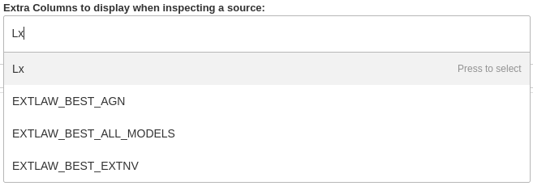

Finally, we have the option to specify which column values we would like to be displayed to us when we are inspecting a queried source. These can be especially useful for when you have missing data which can't accurately be trained on but would improve the classification potential of the user if a source has the information available.

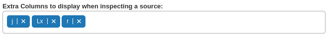

To summaries, our final parameter assignment settings looks like the following:

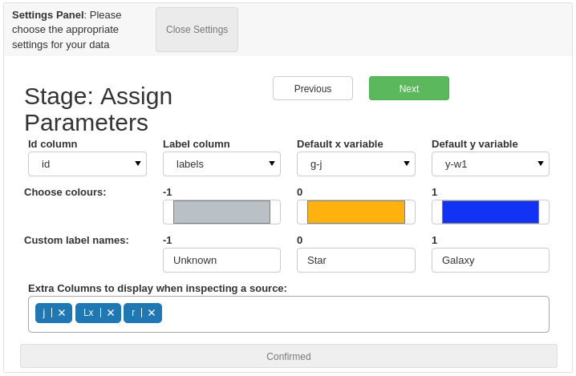

Active Learning Settings
*************************

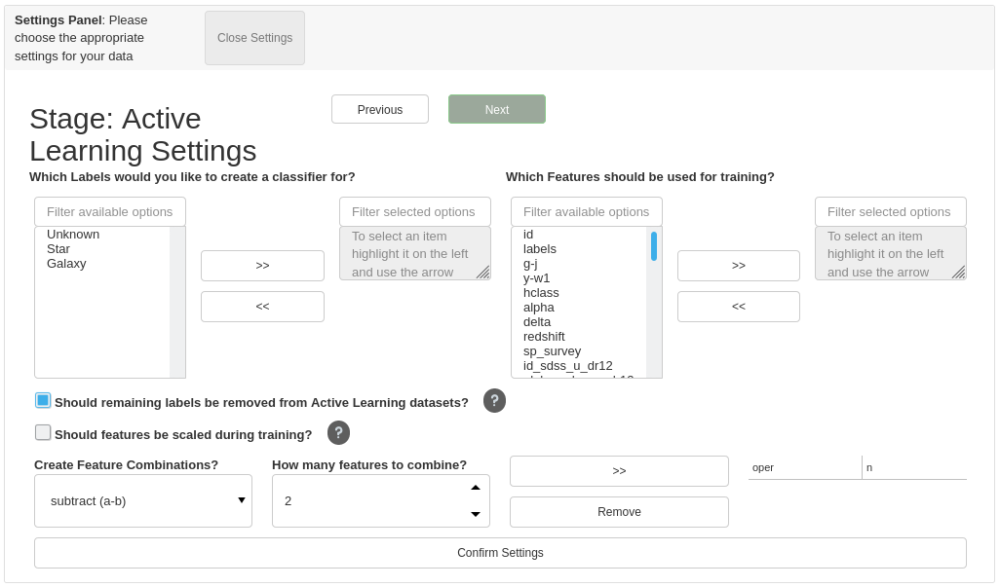
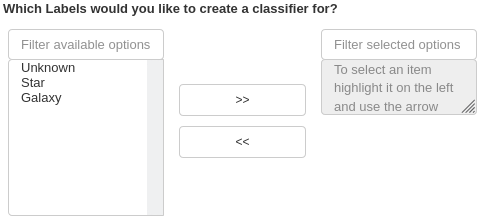
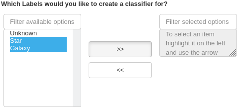
.. image:: ../../images/training_tutorial_settings_assign_params_14.png
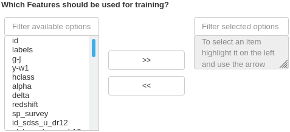
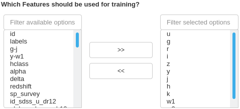
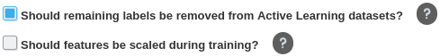
.. image:: ../../images/training_tutorial_settings_assign_params_18.png
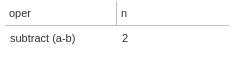
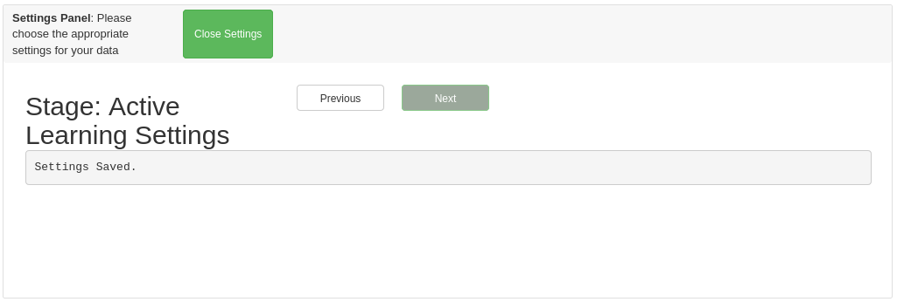

Choosing your model
-------------------------------------

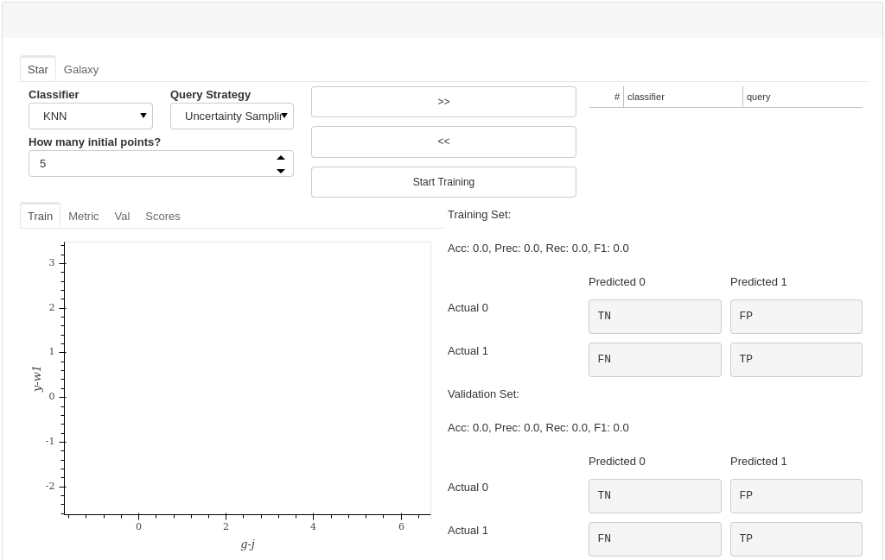
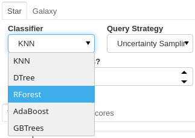
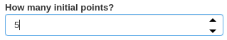
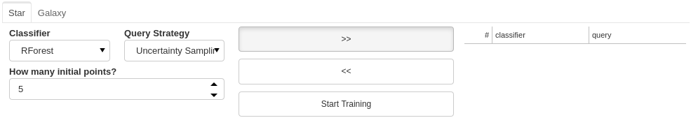
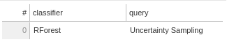
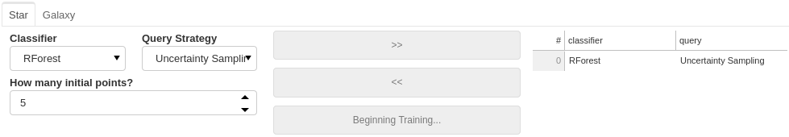

Let the training begin!
-------------------------------------

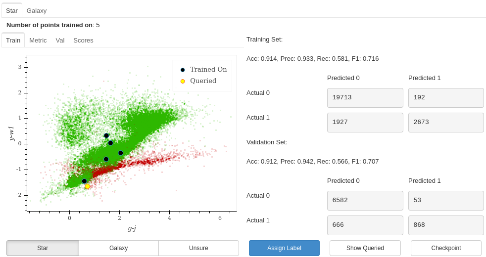

Exploring each source
**********************************

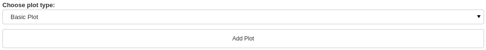
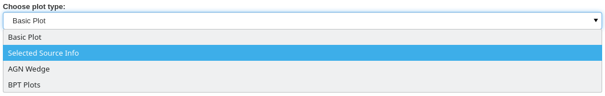
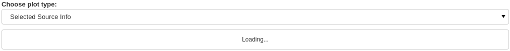
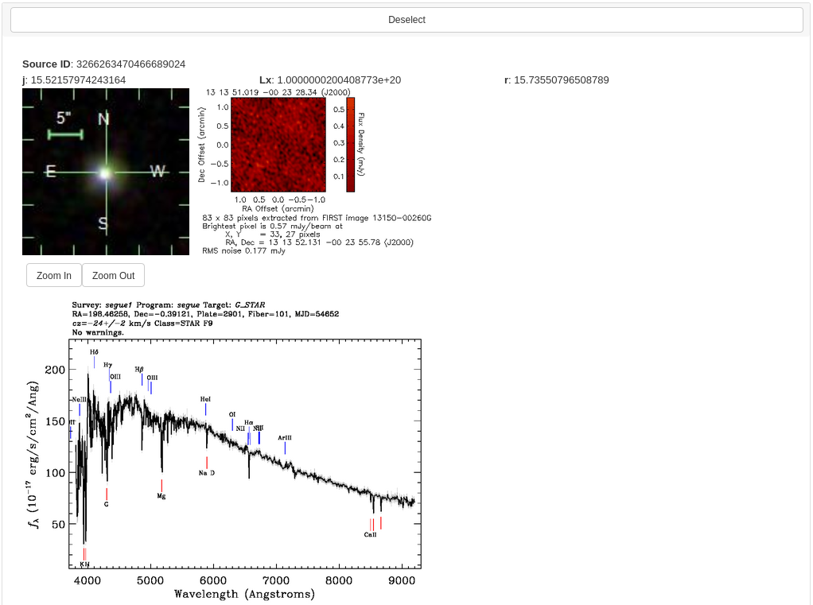
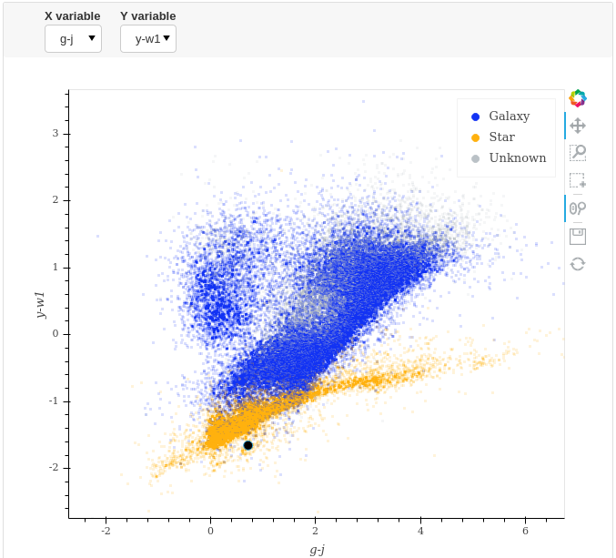
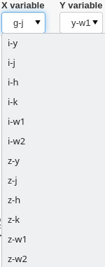
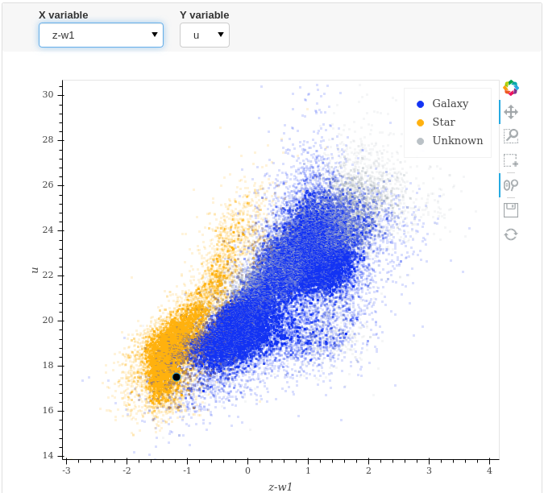
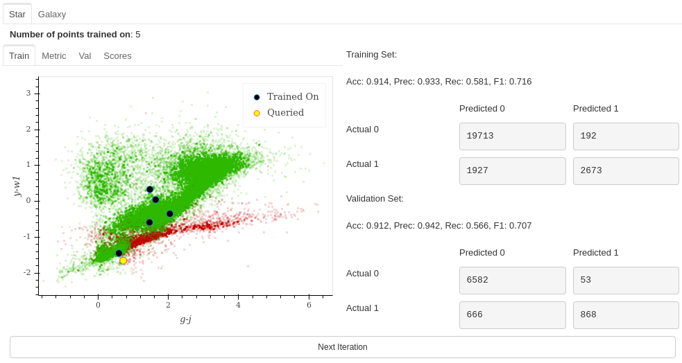

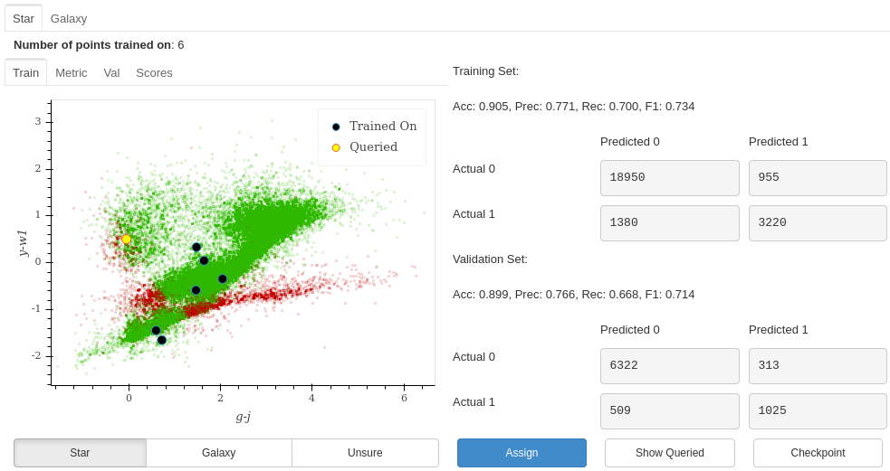

Checking Progress
********************************

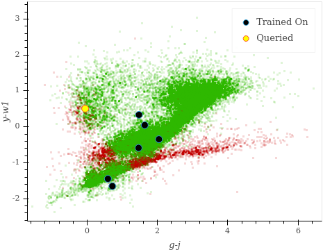
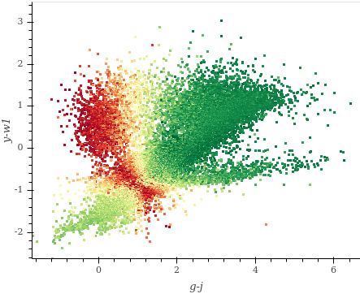
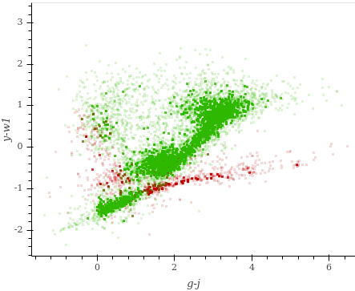
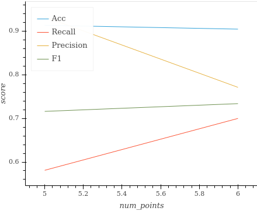

It's ok to be unsure
*********************************

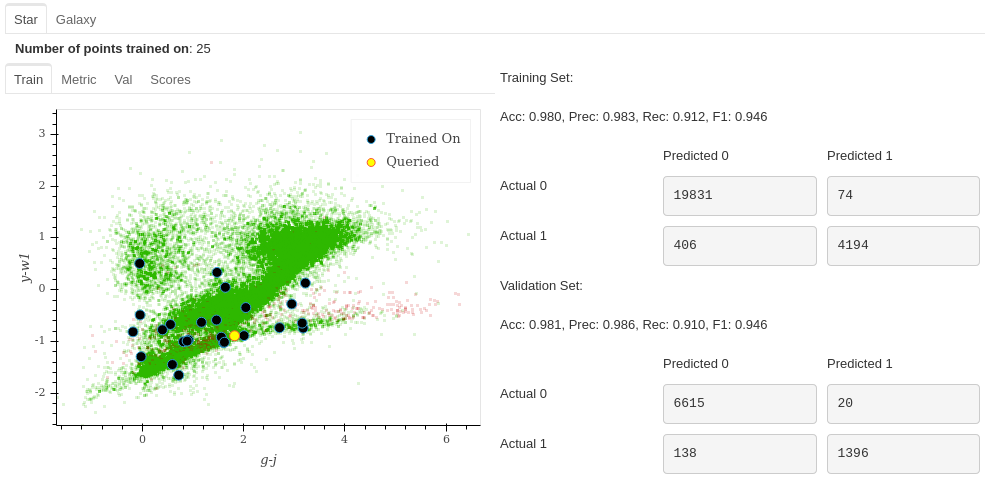
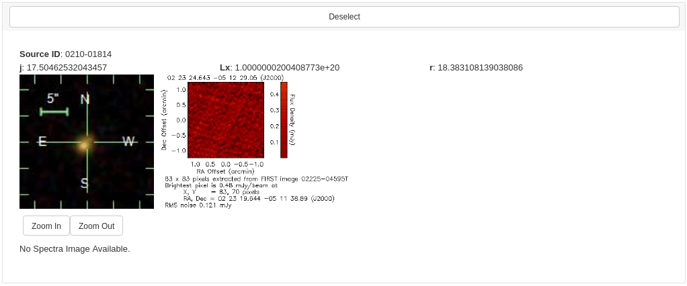
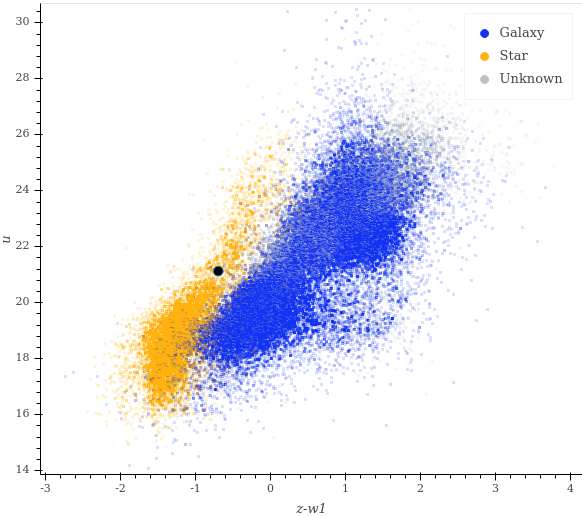

Seeing the Results
-----------------------------

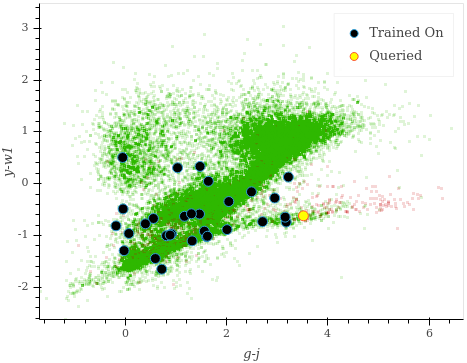
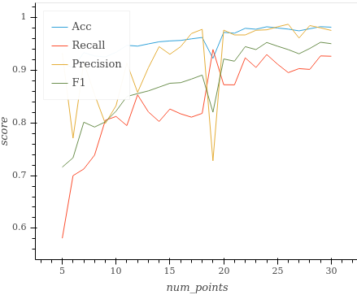

Saving your model
----------------------------

