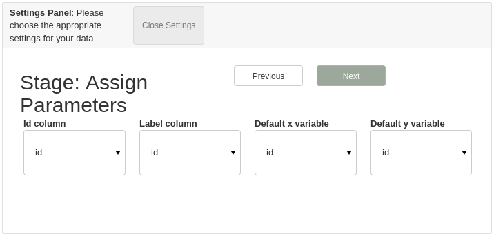
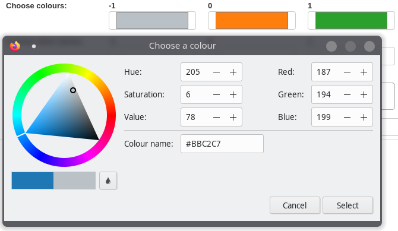

Training a Classifier: From Start to Finish
=======================================================

In this tutorial we will go through the process of training a star classifier using astronomicAL.

Completing the data setup
-----------------------------------

.. image:: ../../images/training_tutorial_settings_loading_data.png

.. image:: ../../images/training_tutorial_settings_loading_data_complete.png

.. image:: ../../images/training_tutorial_settings_assign_params_1.png
.. image:: ../../images/training_tutorial_settings_assign_params_2.png
.. image:: ../../images/training_tutorial_settings_assign_params_3.png

.. image:: ../../images/training_tutorial_settings_assign_params_5.png

.. image:: ../../images/training_tutorial_settings_assign_params_7.png
.. image:: ../../images/training_tutorial_settings_assign_params_8.png
.. image:: ../../images/training_tutorial_settings_assign_params_9.png
.. image:: ../../images/training_tutorial_settings_assign_params_10.png
.. image:: ../../images/training_tutorial_settings_assign_params_11.png
.. image:: ../../images/training_tutorial_settings_assign_params_12.png
.. image:: ../../images/training_tutorial_settings_assign_params_13.png
.. image:: ../../images/training_tutorial_settings_assign_params_14.png
.. image:: ../../images/training_tutorial_settings_assign_params_15.png
.. image:: ../../images/training_tutorial_settings_assign_params_16.png
.. image:: ../../images/training_tutorial_settings_assign_params_17.png
.. image:: ../../images/training_tutorial_settings_assign_params_18.png
.. image:: ../../images/training_tutorial_settings_assign_params_19.png
.. image:: ../../images/training_tutorial_settings_assign_params_20.png

Choosing your model
-------------------------------------

.. image:: ../../images/training_tutorial_AL_0.png
.. image:: ../../images/training_tutorial_AL_1.png
.. image:: ../../images/training_tutorial_AL_2.png
.. image:: ../../images/training_tutorial_AL_3.png
.. image:: ../../images/training_tutorial_AL_4.png
.. image:: ../../images/training_tutorial_AL_5.png

Let the training begin!
-------------------------------------

.. image:: ../../images/training_tutorial_AL_6.png

Exploring each source
**********************************

.. image:: ../../images/training_tutorial_AL_7.png
.. image:: ../../images/training_tutorial_AL_8.png
.. image:: ../../images/training_tutorial_AL_9.png
.. image:: ../../images/training_tutorial_AL_10.png
.. image:: ../../images/training_tutorial_AL_11.png
.. image:: ../../images/training_tutorial_AL_12.png
.. image:: ../../images/training_tutorial_AL_13.png
.. image:: ../../images/training_tutorial_AL_14.png
.. image:: ../../images/training_tutorial_AL_15.png
.. image:: ../../images/training_tutorial_AL_16.png
.. image:: ../../images/training_tutorial_AL_21.png

Checking Progress
********************************

.. image:: ../../images/training_tutorial_AL_17.png
.. image:: ../../images/training_tutorial_AL_18.png
.. image:: ../../images/training_tutorial_AL_19.png
.. image:: ../../images/training_tutorial_AL_20.png

It's ok to be unsure
*********************************

.. image:: ../../images/training_tutorial_AL_22.png
.. image:: ../../images/training_tutorial_AL_23.png
.. image:: ../../images/training_tutorial_AL_24.png
.. image:: ../../images/training_tutorial_AL_25.png

Seeing the Results
-----------------------------

.. image:: ../../images/training_tutorial_AL_26.png
.. image:: ../../images/training_tutorial_AL_27.png

Saving your model
----------------------------

.. image:: ../../images/training_tutorial_AL_28.png
.. image:: ../../images/training_tutorial_AL_29.png
