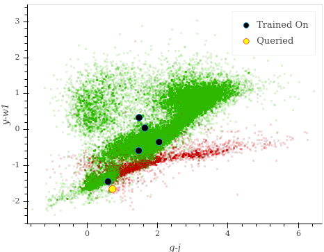
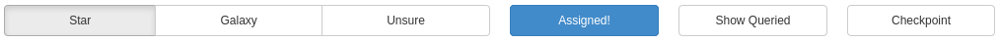
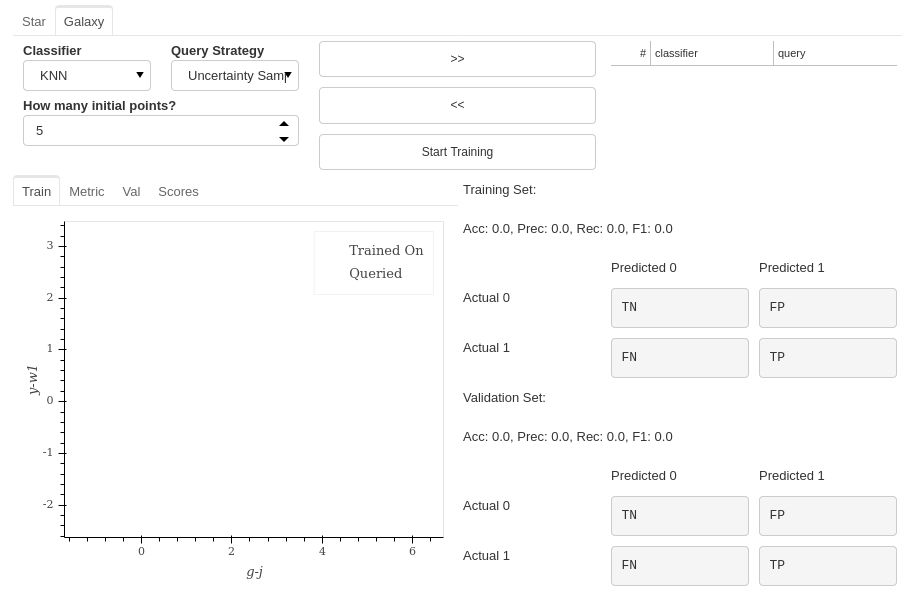
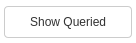

Training a Classifier: From Start to Finish
=======================================================

In this tutorial, we will go through the process of training a Star classifier using astronomicAL.

Completing the data setup
-----------------------------------

Loading a Fits File
***********************

The first step for the user is to load in a dataset from a fits file. All fits files location with the :code:`data` directory will be selectable. To begin with, we are going to load in the :code:`test_data_cpz.fits` file.

.. image:: ../../images/training_tutorial_settings_loading_data.png
  :width: 46%

.. image:: ../../images/training_tutorial_settings_loading_data_complete.png
  :width: 46%

As can be seen above, the green Next button appears after the file has finished loading.

.. note::
  The **Optimise for memory** option allows the user to reduce the overall memory consumption of the dataset; however, this will increase the time it takes to load in the fits file and will delay the user from progressing to the next stage. The more columns you have in your dataset, the bigger the overall improvement on memory; however, this also results in the longest loading times.

Assigning Parameters
**********************

To make astronomicAL as accessible as possible, there are very few requirements on columns. Where there are requirements, the user can specify their corresponding column in the following dropdowns.

.. image:: ../../images/training_tutorial_settings_assign_params_1.png
  :width: 65%
  :align: center

When the user chooses their labels column, the UI will autofill extra options for each unique label.

.. image:: ../../images/training_tutorial_settings_assign_params_2.png
  :width: 65%
  :align: center

Each label can have a unique colour assigned and a custom string identifier, all of which will be used throughout the rest of the UI.

.. .. image:: ../../images/training_tutorial_settings_assign_params_4.png
.. image:: ../../images/training_tutorial_settings_assign_params_5.png
  :width: 65%
  :align: center
.. .. image:: ../../images/training_tutorial_settings_assign_params_6.png
.. image:: ../../images/training_tutorial_settings_assign_params_7.png
  :width: 65%
  :align: center

For this classification task, we have assigned Unknown, Star and Galaxy labels.

.. image:: ../../images/training_tutorial_settings_assign_params_3.png
  :align: center

Next, we must assign the default x and y axis variables. The columns chosen will become our default axes for many of the Active Learning plots, as well as being the opening axes in the :code:`basic plot`.

.. warning::
  The Active Learning plots use the subset of the columns of the full dataset that the models train on, **the** :code:`default_x_variable` **and** :code:`default_y_variable` **must be features that you train your model on**.

.. raw:: html

   

.. image:: ../../images/training_tutorial_settings_assign_params_8.png

Finally, we can specify which column values we would like to be displayed to us when we are inspecting a queried source. These extra bits of information can be especially useful when you have missing data that can't be trained on accurately but would improve the user's classification potential if a source has the information available.

In our example, we make use of the :code:`j` and :code:`r` photometry bands and :code:`Lx`, which represents the X-ray Luminosity of the source, which only a fraction of the sources have but can often be the deciding factor on a source's classification.

.. image:: ../../images/training_tutorial_settings_assign_params_9.png

.. raw:: html

   

To summarise, our final parameter assignment settings look like the following:

.. image:: ../../images/training_tutorial_settings_assign_params_10.png

Active Learning Settings
*************************

At first sight, the Active Learning settings panel looks a little overwhelming, but we will go through each part to ensure the user is able to tune their models exactly how they need.

.. image:: ../../images/training_tutorial_settings_assign_params_11.png

.. raw:: html

   

Selecting the Classifiers
~~~~~~~~~~~~~~~~~~~~~~~~~~

The first step is to decide which classifiers we require to train. Currently, astronomicAL produces a separate one-vs-rest classifier for each label as we have found this often produces more accurate predictions than a single multiclass classifier.

.. image:: ../../images/training_tutorial_settings_assign_params_12.png
.. image:: ../../images/training_tutorial_settings_assign_params_13.png
.. image:: ../../images/training_tutorial_settings_assign_params_14.png

.. raw:: html

   

We are also given two options, both of which could big implications on each models performance.

.. image:: ../../images/training_tutorial_settings_assign_params_17.png

Should Remaining Labels be Removed from Active Learning Datasets?
~~~~~~~~~~~~~~~~~~~~~~~~~~~~~~~~~~~~~~~~~~~~~~~~~~~~~~~~~~~~~~~~~~~
If you choose not to create a classifier for a particular label, this option decides whether data with the left-out label should be included in the training, validation, and test sets.

Taking our dataset as an example, we chose not to make an *Unknown* classifier as sources with this label likely show characteristics of both classes. Hence, it's unlikely to produce a very useful classifier.

*However, is that a good enough reason to remove nearly 20% of the dataset when it comes to training and testing a model?*

.. note::

  Selecting this option will only remove the data that gets inputted into the Active Learning process. The full dataset, including plots, will still contain all the data regardless of whether this option has been selected or not.

Dealing with unknown labels
~~~~~~~~~~~~~~~~~~~~~~~~~~~~~~~~~

*Why would you remove unknown data when we are relabelling the data anyway?*
^^^^^^^^^^^^^^^^^^^^^^^^^^^^^^^^^^^^^^^^^^^^^^^^^^^^^^^^^^^^^^^^^^^^^^^^^^^^^^^

Our case's main problem is that having an *Unknown* label means that during any of the predictions, the model will never predict *unknown*; it will predict a yes or no for whether it belongs to the label being trained on.

During the preprocessing stages, any label that isn't the one being trained on is assigned 0 (or no); therefore, any unknown source is classified as a no, irrespective if it later turns out to belong to the class you were training on. For this reason, your scoring metrics of your model will look as though it is performing worse than it actually is.

For this reason, in our example, we will remove any *unknown* data from the Active Learning process.

*What if I have no labels?*
^^^^^^^^^^^^^^^^^^^^^^^^^^^^^^^^^^^^^^^^^^^^^^^^^^^^^^^^^^^^^^^^^^^^^^^^^^^^^^^
If you have a large dataset without any labels, you will not get any indication of how well your model is doing throughout the training process. However, because you *are* labelling data throughout the training process, you will still produce a legitimate model that will likely be producing accurate predictions.

The recommended course of action would be to go through your dataset and create a representative subset that you manually label. You can then be confident in these labels' reliability, allowing you to take a trained model from your unlabelled data and see how it performs on this tailored sample. If it performs well, you can be confident in the predictions it has made on the rest of the unlabelled data and now have full use of the potentially millions of previously unlabelled points.

.. note::
  **What if I want to keep one label in the data but remove another, where both labels will not have classifiers?**

  If you have multiple remaining labels and want to remove some but no all, it is recommended to move all the labels that you want to keep in the data to the classifier side. Each classifier is trained separately, and so you can simply not train a particular classifier that isn't needed.

Should Features be scaled?
~~~~~~~~~~~~~~~~~~~~~~~~~~~~~~~~~~~~~~~~~~~~~~~~~~~~~~~~~~~~~~~~~~~
In many cases scaling your data can be effective at improving model performance. By selecting this option, all data given to the Active Learning models will be scaled according to the training set.

This scaling is all handled by the system, however, if selected, the user must scale any new data they want predictions from according to the original training data. For this reason, during the training process, astronomicAL will save the scaler produced alongside the current model.

.. raw:: html

  

Selecting Your features
~~~~~~~~~~~~~~~~~~~~~~~~~~~~~~~~~~~~~~~~~~~~~~~~~~~~~~~~~~~~~~~~~~~

.. image:: ../../images/training_tutorial_settings_assign_params_15.png

Given that your fits files will likely contain many more columns than those you require for training, you must select which columns will become your features in your model.

.. note::

	If you want to train on features that are combinations of each other, for example, when creating colours with photometry data, you don't need to include them in your fits file. The only features you need to include are base features that cannot be created from the combination of any other features.

In this example, our base features will be photometry bands :code:`u`-:code:`W2`.

.. image:: ../../images/training_tutorial_settings_assign_params_16.png

.. raw:: html

   

Creating Feature Combinations
~~~~~~~~~~~~~~~~~~~~~~~~~~~~~~~~~~~

The next step is to create any of the feature combinations we require. By default, astronomicAL allows you to add, subtract, multiply and divide any :code:`n` features.

.. caution::

	To find all the combinations of :math:`r` features of out all your baseline features of size :math:`n`, the following equation is used:
  .. math::

    \frac{n!}{r!(n-r)!}

  This quickly results in a huge number of additional features as : math:'r'and:math:`n` get larger. Please bear this in mind when adding these features, as this can increase training times substantially and have a negative impact on the performance of the dashboard.

.. note::

	Even though subtraction and division are not commutative or associative, we thought it was useful to the user to have the option to apply these operations to more than two features, especially when :ref:`creating a custom feature generation function<custom_features>`.

.. image:: ../../images/training_tutorial_settings_assign_params_18.png

For all the combinations you add, which are displayed to you on the right-hand side of the row, all of the produced features will be available in both the Active Learning data as well as being plottable in the basic plot.

.. image:: ../../images/training_tutorial_settings_assign_params_19.png

In this run, we have generated the colours from the photometric bands we chose earlier.

.. raw:: html

   

.. image:: ../../images/training_tutorial_settings_assign_params_20.png

And this brings us to the end of the settings panel. We are now presented with a close button that will initialise the Active Learning Dashboard.

.. raw:: html

   

Creating an Active Learning-based Classifier
---------------------------------------------

.. image:: ../../images/training_tutorial_AL_0.png

The Active Learning Dashboard is arranged in two sets of tabs:

  1. A Tab for each label classifier that you chose in the previous settings will encapsulate everything you need to know about that particular one-vs-rest classifier.

  2. Inside each classifier tab, you have a set of tabs showing different plots specifically related to how the classifier is performing.

In this example, we will only be using the :code:`Star` tab as we are only training the Star classifier, but the same steps will be the same for each classifier you choose to train.

.. raw:: html

   

Choosing your model
****************************************

For each classifier tab, the user can assign which classifiers they want to use for the Active Learning process.

.. image:: ../../images/training_tutorial_AL_1.png

.. raw:: html

   

Choosing a Query strategy
**************************************

The main idea of Active Learning is that instead of piling as much data as possible onto a model to train on, you can get equal or better performance with substantially less data if you analytically choose the most informative data points according to a metric. The query strategy *is* that metric.

Each classifier that you select is paired with your chosen query strategy.

In this run, we are using a Random Forest classifier with an Uncertainty Sampling query strategy.

.. image:: ../../images/training_tutorial_AL_4.png

.. raw:: html

   

Creating a Committee
*****************************
Even though we have only used a single classifier in this example, you are not restricted to only one. You can use any number of classifiers for your model, leading to an ensemble of classifiers known as a committee in Active Learning.

If you choose to create a committee, at each iteration of Active Learning, each classifier will have to retrain, increasing the waiting times between queries.

When using a committee, whenever the model is saved, rather than being a single file for the classifier, it is saved as a folder of classifier files, which would need to continue being used together as an ensemble.

.. note::

	When adding multiple classifiers, you will still add a separate query strategy for each; however, these are not used during training. Instead, the query strategy becomes the *vote entropy*, where the most informative point is the one that has the biggest disagreement between classifiers.

.. raw:: html

   

How Many Initial Points?
***************************
.. image:: ../../images/training_tutorial_AL_2.png
  :align: center

The final decision is to choose how many initial points to start the training process with. These points are chosen randomly, so choosing a high number may negatively impact Active Learning effectiveness and may reduce the maximum possible performance of your model. However, you will likely reduce the time spent on training and labelling.

Choosing a low number has the benefit that at the point you stop training, the majority of the points accumulated in your model's training set will have been selected based on their informativeness. However, to get good performance, you will have to hand-label more points which could become time-consuming.

.. raw:: html

   

.. image:: ../../images/training_tutorial_AL_5.png

Here is the final setup for our Star classifier. Now onto the fun part!

Let the training begin!
-------------------------------------

Immediately after confirming the classifier settings, your model will begin training on some randomly selected points; how many is determined by the number you selected in the previous section.

The First Results
***************************

.. image:: ../../images/training_tutorial_AL_6.png

Once trained, you will be presented with a colourful plot showing all your training data, with the axes specified in your :code:`default_x_variable` and :code:`default_y_variable` settings back at the beginning. All the green points are your model's correct predictions, and red is your incorrect predictions. The blue dots are the 5 randomly chosen initial points, and the yellow point is the most informative source for my query strategy.

Good Results, Bad Predictions
~~~~~~~~~~~~~~~~~~~~~~~~~~~~~~
At first glance, it seems like the model is performing amazingly: 91% accuracy in both training and validation sets using only 5 points! Active Learning is good, but it's not *that* good.

If we look at the confusion matrices on the right-hand side, we can see that the model has a large tendency to predict 0. The split between Stars and Galaxies here is roughly 20:80; predicting heavily that sources are not Stars produces high accuracy scores, however when we look at the other metrics, specifically Recall, we see that the performance is not as promising as we first thought.

The Labelling Process
**************************

To improve our results across all metrics, we will need to add some more labelled data for the model to train on. However, we know very little about the current queried point and cannot make a confident classification without more information about the source.

So let's get more information about the source.

Exploring each source
~~~~~~~~~~~~~~~~~~~~~~~~~

.. image:: ../../images/training_tutorial_AL_7.png

Throughout the UI, you will have already noticed several **Choose plot type** panels. This is where the user is able to see more about each source at one time than would normally be possible.

Selected Source Information
^^^^^^^^^^^^^^^^^^^^^^^^^^^^^

.. image:: ../../images/training_tutorial_AL_8.png

One of the available plots is the :code:`Selected Source Information`, which is more of a mini dashboard than a plot, but it allows us to see key information about the selected source.

.. .. image:: ../../images/training_tutorial_AL_9.png
.. image:: ../../images/training_tutorial_AL_10.png

As you can see, we now get the crucial information required to make a confident classification of the source.

By default, the Optical and Radio images of the source are pulled from online databases. This is provided free to the user as all that is required is the location of the source. Given that area of the sky has been sampled, the images will be provided.

We also see the 3 column values we specified in the settings earlier.

Sometimes, however, even this information may not be enough, and that is where the other plots are extremely useful.

The Basic Plot
^^^^^^^^^^^^^^^^^^^^^^^^^

The basic plot allows you to choose any :code:`X` and :code:`Y` axes from all the columns in your original fits file, as well as the additional features you created earlier.

When you first load the basic plot, the axes displayed will be your specified :code:`default_x_variable` and :code:`default_y_variable`, along with the colours you chose at the beginning for each label. As these are the same axes displayed in the Active Learning panel, we can now take a more detailed look at where things are going wrong.

.. image:: ../../images/training_tutorial_AL_11.png
  :width: 47%

It is now very evident that the majority of the incorrect points are Stars, likely meaning the 4 training points in the centre were all labelled as Galaxies and the bottom left point labelled as a Star.

.. raw:: html

   

Let's look at some of the other generated features and see if they can visually separate Stars and Galaxies.

.. image:: ../../images/training_tutorial_AL_12.png
.. image:: ../../images/training_tutorial_AL_13.png
  :width: 70%

All plots are rendered using Bokeh_ and optimised using Datashader_, enabling you to plot millions of points at once whilst still remaining responsive.

.. _Datashader: http://holoviews.org/user_guide/Large_Data.html
.. _Bokeh: https://docs.bokeh.org/en/latest/index.html

.. image:: ../../images/interactive_plot.gif

.. raw:: html

   

Once again, we can see clear clustering between the two sets of objects; however, the overlapping boundary is still problematic. That being said, taking all the information into consideration, I think we can assign this source the Star label and continue training.

.. image:: ../../images/training_tutorial_AL_15.png

.. raw:: html

   

The model has now been retrained with the addition of the extra star and now a new *most informative* point has been queried.

.. image:: ../../images/training_tutorial_AL_16.png

Analysing the Performance Scores
************************************

If you look at the score for this iteration, you can see that the accuracy has decreased, with the validation now dropping below 90%!

*Does that mean the model is now worse?*

Well, if we look at our new Recall score, it has increased by over 0.1 (with 1 being the maximum) for both training and validation sets. This means that our model is now labelling more Stars correctly.

However, this time our Precision seems to have taken a hit - dropping by more than 0.15. This means that the model is now classifying a lot more Galaxies as Stars. This can be seen by the new red (incorrect) points above the bottom two labelled points, where the new Star we just labelled seems to have tipped the scales for those points from being classified as Galaxies to now being classified as Stars.

These new incorrect classifications are likely to be corrected in the next iteration as after inspecting the information for the new queried source, we can confidently label this as a Galaxy.

.. image:: ../../images/training_tutorial_AL_21.png

.. raw:: html

   

Checking Training Progress
********************************

Now is a good time to look at the rest of the plots available to us within the Active Learning panel.

Training Set Plot
~~~~~~~~~~~~~~~~~~~~~~~~~~~~~

.. image:: ../../images/training_tutorial_AL_17.png

As we have seen already, in this plot, we seen all the data within our training set, plotted according to whether our current model has predicted correctly. We also see which points the model has so far trained on and also the queried point which would provide the most information to the model if it was labelled.

.. note::

	It is easy to get confused by the difference between the **training set** and the **points the model has trained on**.

  To clarify:

    **training set** = **training pool** + **points the model has trained on**

  Where the **training pool** are all the points the model gets to choose from when querying its next source.

.. raw:: html

   

Metric Plot
~~~~~~~~~~~~~~~~~~~~~~~~~~~~~

.. image:: ../../images/training_tutorial_AL_18.png

Arguably the most interesting of the plots to look at, due to it being the driver for the entire Active Learning process, the metric plot is a visualisation of the query strategy. As we are using **Uncertainty Sampling**, this visualises the certainty the model has in its prediction. Green means the model is very confident in its prediction; Red means it's very unsure and can't decide whether the source is a Star or Galaxy.

.. caution::

	It is important to note that it will, at times, look as though the areas of high uncertainty match the areas of incorrect predictions from the model. However, with the query strategies we are using, the Active Learning query process completely ignores which label the model assigns to a source and therefore is not affected by correctness.

  It is easy to misunderstand this as *Active Learning improves your model's accuracy* when all it is doing is reducing the uncertainty of the most uncertain point at that particular iteration. It just so happens that for many cases, the accuracy and other performance scores increase as a byproduct.

.. raw:: html

   

Validation Set Plot
~~~~~~~~~~~~~~~~~~~~~~~~~~~~~

Next, we have the validation set plot, which is plotted according to its correctness, just like the training set plot.

The plot looks less densely packed because it is only 20% of the original dataset, whereas the training set is 60% of the original dataset.

.. image:: ../../images/training_tutorial_AL_19.png

.. raw:: html

   

Score Tracking Plot
~~~~~~~~~~~~~~~~~~~~~~~~~~~~~

.. image:: ../../images/training_tutorial_AL_20.png

The score tracking plot does exactly that - tracks scores. This is useful for seeing the overall trend of your models improvement. As is commonly the case, you may start to notice your scores make smaller and smaller changes as more labelled data are added to the model, eventually possibly leading to basically a flat line over multiple iterations. Although there aren't specific stopping criteria for Active Learning, having your scores converge in this way, with no changes in performance as you add more data, might be a good time to stop.

.. raw:: html

   

It's OK to be Unsure
*********************************

If we skip ahead in the training process a bit, we can see how to approach the situation where you don't know what you should label the source.

.. image:: ../../images/training_tutorial_AL_22.png

As you can see, our model has improved all its metrics to over 0.91, with accuracy now at 98%, all whilst only training on 25 points. Pretty good!

.. image:: ../../images/training_tutorial_AL_23.png
However, our latest source has caused us to pause for a moment. This source is missing its spectra, meaning we need to use the other plots to determine its label. The optical image definitely shows what looks like a bulge, indicating it could be a Galaxy.

.. image:: ../../images/training_tutorial_AL_24.png

However, this plot shows this source is in a region heavily dominated by stars.

Given that the model is training on such a small amount of data (only 25 points!), it is not worth risking a potential incorrect label that could dramatically affect our models' performance.

.. image:: ../../images/training_tutorial_AL_25.png

So we will assign it as Unsure, which removes this point from the training set, and then re-query for the next most informative source.

No harm done!

Seeing the Results
-----------------------------

Training a little further (up to 30 points), let's see how our Star classifier has performed.

.. image:: ../../images/training_tutorial_AL_27.png
  :width: 47%

.. image:: ../../images/training_tutorial_AL_26.png
  :width: 49%

As you can see, the performance overall continues to improve. There are occasional drops, likely due to a queried point being in a part of the search space that has yet to be explored and causing local points to change label abruptly; however, they bounce back almost immediately.

The model would likely improve further if we continued to add a few extra points. Even the next queried point shown on the right would likely correct most of the incorrect points trailing off to its right.

Saving your model
----------------------------

Now that the model has reached a suitable performance for us to apply it to new and unseen data, it is important that we save it for reusability and portability.

Well, the good news is that after each iteration of Active Learning, astronomicAL automatically saves a copy of your model inside the :code:`models/` directory in the form :code:`label-Classifier_QueryStrategy.joblib`. This gets overwritten at each iteration, so it is always the most up-to-date. However, when you require something more permanent, you can use the :code:`Checkpoint` button.

.. image:: ../../images/training_tutorial_AL_28.png

This can be pressed once per iteration and will save your current model in the form :code:`label-Classifier_QueryStrategy-iteration-validationF1score-YYYYMMDD_H:M:S.joblib`
to allow you to choose your best performing or most recent model quickly.

What About The Other Classifiers?
----------------------------------

In this example, we only made use of the Star classifier; well, what about the Galaxy classifier?

As you can see, each classifier tab is independent of the others, allowing you to tailor each classifier for each label. The workflow for training multiple classifiers is down to preference. You could focus on a single classifier until you are happy with its performance, then move on to the next, or you could assign a label for a source on one classifier, then switch over tabs and label a source on one of the other classifiers, each will produce the same results.

.. raw:: html

   

If you lose track of which tab the selected source is from, you can simply select the :code:`Show Queried` button to reselect the current classifier's queried point.
