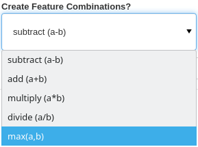

.. _custom_features:

Adding custom features to your model
====================================================

The features that are given to the model can often be the deciding factor for how well a model is able to produce accurate predictions. This is arguably even more so when approaching the problem using a method such as Active Learning, where you may only being using a tiny fraction of your entire dataset.

Custom Features
---------------------------------------------------
Custom generated features can be added as a new function to :doc:`astronomicAL.extensions.feature_generation <../apireference/extensions>`.

There are some requirements when declaring a new feature generation function:

1. The new function must have 2 input parameters:
  - :code:`df` - The dataframe containing the entire dataset.
  - :code:`n` - The number of features involved in the operation.

  .. note::
      If your particular operation does not easily scale to more than 2 features at a time, then you can simply not make use of the :code:`n` input parameter inside your function.
      **However you must still include** :code:`n` **as an input parameter, even if you dont use it.**

2. The function must return the following:
  - :code:`df` - The updated dataframe with the newly generated features.
  - :code:`generated_features` - a list containing the updated column names.

3. The created function must be added as a new value to the :code:`oper` dictionary within the :code:`get_oper_dict` function, with a brief string key identifying the operation.

Within the function, you can generate the combinations of features using:

.. code-block:: python
  :linenos:

  base_features = config.settings["features_for_training"]
  combs = list(combinations(base_features, n))

Creating Colours
********************************************
Given the prevalence of photometry data, the most common additional features to create are colours. In astronomicAL, these are provided with the default `subtract (a-b)` with a combination value of 2.

Example: Max(a, b)
-----------------------------------
In this example we will show how we would go about creating a new :code:`max` function. Although the produced features from this specific function may not be particularly useful for improving a model's performance, it works well as an example.

.. code-block:: python
  :linenos:

  def max_oper(df, n): # The function must include the parameters df and n

      np.random.seed(0) # set random seed if required for reproducability

      base_features = config.settings["features_for_training"] # get the base features chosen by the user

      combs = list(combinations(base_features, n)) # a list of all the combinations of n base_features

      cols = list(df.columns) # all the columns in the dataset
      generated_features = [] # The list that will keep track of all the new feature names
      for comb in combs: #loop over all combination tuples
          new_feature_name = "max(" # start of feature name
          for i in range(n): # loop over each feature in tuple
              new_feature_name = new_feature_name + f"{comb[i]}" # add each feature in operation
              if i != (n - 1):
                  new_feature_name = new_feature_name + "," # seperate features by a comma
              else:
                  new_feature_name = new_feature_name + ")"
          generated_features.append(new_feature_name) # add new feature name which is the form: max(f_1,f_2,...,f_n)
          if new_feature_name not in cols: # if the feature already exists in the data, dont recalculate
              for i in range(n): # Loop of each individual feature in comb
                  if i == 0:
                      df[new_feature_name] = df[comb[i]] # add the new column and set its value to the starting feature
                  else:
                      df[new_feature_name] = np.maximum(df[new_feature_name], df[comb[i]]) #calculate the running maximum

      return df, generated_features  # The function must return the updated dataframe and the list of generated features

Finally adding the new entry in the :code:`oper` dictionary, **without specifying the parameters**:

.. code-block:: python

  def get_oper_dict():

      oper = {
          "subtract (a-b)": subtract,
          "add (a+b)": add,
          "multiply (a*b)": multiply,
          "divide (a/b)": divide,
          "max(a,b)": max_oper, # Newly created function
      }

      return oper

And that is all that is required. The new :code:`max_oper` function is now available to use in astronomicAL:

