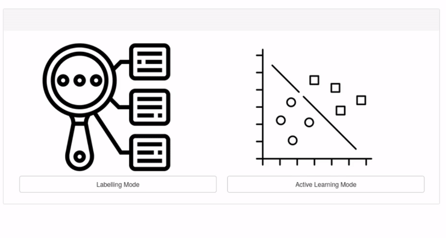

Creating a Labelled Test Set
========================================

Overview
----------
Pre-assigned labels in surveys are often unreliable due to ambigious class boundaries and data limited information about each source. This is especially true when dealing with rarer classes. AstronomicAL allows you to create your own test set by allowing you to manually label the points whilst viewing all the required information to ensure that the labels are reliable and sifficient for proving your model is accurate and generalisable.

Load Configuration
**********************************
It is quick and easy to load a previous configuration file for **Labelling Mode** and uses the same settings setup as in **Active Learning Mode**, allowing you to jump between them when necessary.

Search Space
**********************************
By default, AstronomicAL will choose a point at random within your dataset when selecting a new point to label. However, it is often the case that sources with certain information available are more desirable to have in your test set than one that are missing this information.

AstronomicAL allows you to restrict your search space to only sources that match your specified criteria. Each addition criteria is match with an *AND* operator and so only when a source matches all criteria will it be available.

To remove a chosen criterion, simply select it from the **Criterion to Remove** dropdown and press the **Remove Criterion** button.

Labelling Your Data
**********************************
Pressing the **New** button will select a random source from your selection criteria, updating all the plots you have visible with this updated source. Once you are happy with the label you have selected and press **Assign Label**. These labels are automatically saved to :code:`data/test_set.json`.

Using Your New Test Set
**********************************
Once you have labelled a sufficient number of sources, you can use your test set by checking the **Should data/test_set.json be the used test set?** box in the Active Learning Settings panel.

If you have already began training a classifier and want to keep your progress, simply edit the configuration file you are using and set the :code:`"test_set_file"` flag to :code:`true`.

If you dont set this flag, the code will automatically generate a test set from your data using the labels in your :code:`default label` column.
