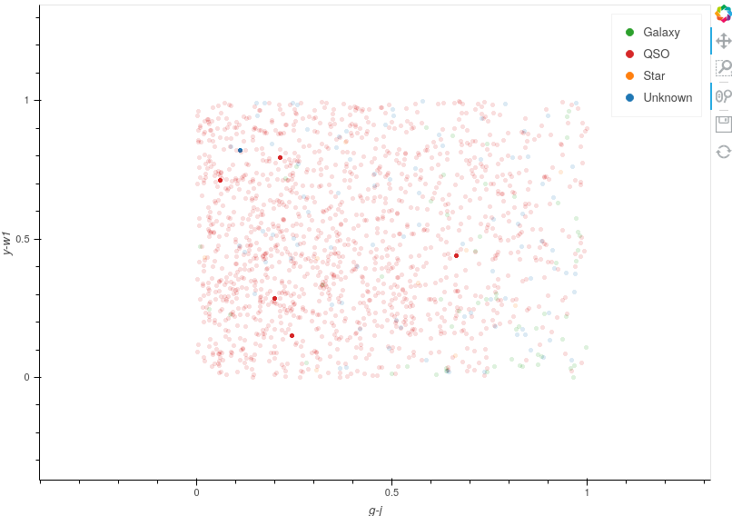

Creating Custom Plots
========================================

Overview
----------
To assign accurate labels to sources, it is important that user is presented with as full of a picture about each source as possible, therefore the ability to create specialised plots is paramount.

Simple
**********************************
astronomicAL allows for fast plot creation with the use of the :code:`create_plot` function which abstracts away the potentially complicated plotting code that is normally required and replaces it with a simple one-line call.

Optimised
**********************************
By default all custom plots have Datashader_ implemented, allowing millions of datapoints to be plotted at once whilst still remaining responsive.

.. _Datashader: http://holoviews.org/user_guide/Large_Data.html

Collaborative
**********************************
Allowing researchers to share their designs is pivotal for collaborative research. For this reason, we make it seamless to share your designs with others by automatically creating a settings page to allow new users to select which columns in their own datasets correspond with the naming convention of the author.

Custom Plots
--------------------------
Custom plots can be added as a new function to :doc:`astronomicAL.extensions.extension_plots <../apireference/extensions>`.

There are some requirements when declaring a new feature generation function:

1. The new function must have 2 input parameters:
  - :code:`data` - The dataframe containing the entire dataset.
  - :code:`selected` - The currently selected points (Default:None)

2. The function must return the following:
  - :code:`plot` - The final plot to be rendered

3. The created function must be added in the form :code:`CustomPlot(new_plot_function, list_of_columns_used)` as a new value to the :code:`plot_dict` dictionary within the :code:`get_plot_dict` function, with a brief string key identifying the plot.

.. note::
    When using :code:`create_plot` within your custom plot functions, whenever you make use of a column name from your dataset you must reference it as a key from the :code:`config.settings` dictionary.

    For example: :code:`"x_axis_feature"` should always be written as :code:`config.settings["x_axis_feature"]`.

    If this is not done then you will likely cause a :code:`KeyError` to any external researchers who want to use your plot but have a different dataset with different column names.

Example: Plotting :math:`Y=X^2`
-----------------------------------
In this example we will show the simple case of creating a custom plot which shows :math:`Y=X^2` plotted along with the data.

.. code-block:: python
  :linenos:

  def x_squared(data, selected=None): # The function must include the parameters df, selected=None

      # This plots all the data on your chosen axes
      plot_data = create_plot(
          data,
          config.settings["x_axis"], # always use dataset column names as keys to config.settings
          config.settings["y_axis"],
      )

      line_x = np.linspace(
          np.min(data[config.settings["x_axis"]]),
          np.max(data[config.settings["x_axis"]]),
          30,
      ) # define the range of values for x

      line_y = np.square(line_x) # y=x^2

      line_data = pd.DataFrame(
          np.array([line_x, line_y]).T,
          columns=["x", "y"]
      ) # create dataframe with the newly created data

      # This plots the X^2 line
      line = create_plot(
          line_data,
          "x","y", # config.settings is not required here as these column names are not in reference to the main dataset
          plot_type="line", # we want a line drawn
          legend=False, # we don't need a legend for this data
          colours=False # Use default colours
      )

      x_squared_plot = plot_data * line # The * symbol combines multiple plots onto the same figure

      return x_squared_plot # The function must return the plot that is going to be rendered

Finally adding the new entry in the :code:`plot_dict` dictionary, **without specifying the parameters of the plotting function**:

.. code-block:: python

  def get_plot_dict():

      plot_dict = {
          "Mateos 2012 Wedge": CustomPlot(
              mateos_2012_wedge, ["Log10(W3_Flux/W2_Flux)", "Log10(W2_Flux/W1_Flux)"]
          ),
          "BPT Plots": CustomPlot(
              bpt_plot,
              [
                  "Log10(NII_6584_FLUX/H_ALPHA_FLUX)",
                  "Log10(SII_6717_FLUX/H_ALPHA_FLUX)",
                  "Log10(OI_6300_FLUX/H_ALPHA_FLUX)",
                  "Log10(OIII_5007_FLUX/H_BETA_FLUX)",
              ],
          ),
          "X^2": CustomPlot(
              x_squared,
              ["x_axis", "y_axis"],
          ),
      }

      return plot_dict

And that is all that is required. The new :code:`x_squared` plot is now available to use in astronomicAL:

.. image:: ../../images/x_squared_in_plot_list.png

A settings page has automatically been generated, allowing users to selected which of their dataset columns correspond to the authors specified column.

.. image:: ../../images/x_squared_settings.png

Once the columns have been chosen, the user is presented with the brand new :code:`x_squared` plot:

.. image:: ../../images/x_squared_example.png

Optional Plot Flags
-------------------

The :code:`create_plot` function allows users to specify a number of flags to ensure that the plot is as informative as possible.

The following pairs of images are arrange so that the *Flag=On* is on the left and *Flag=Off* on the right.

Colours
********************

The :code:`colours` flag will assign the colours the user specified in the opening settings. By choosing :code:`False`, all points remain the default colour assigned by Datashader.

The default for this value is :code:`True`.

.. raw:: html

   

Legends
*******************

The :code:`legend` flag will include the plotted points in the plot legend. If all plots have this flag set to :code:`False` then no legend will be rendered.

The default for this value is :code:`True`.

.. raw:: html

   

Legend Positions
*******************

The :code:`legend_position` option allows you to position the legend in a more suitable place than the default positioning.

To keep the legend within the plot window you can choose between the following options: :code:`["top_left","top_right","bottom_left","bottom_right"]`.

To position the legend outside of the plot window you can use one of the following options: :code:`["top","bottom","left","right"]`.

The examples above show :code:`["bottom_right"]` and :code:`["left"]` positions.

.. note::
    If all plots have the :code:`legend` flag set to :code:`False` then the :code:`legend_position` flag is ignored and no legend is rendered.

The default for this value is :code:`None`.

.. raw:: html

  

Smaller Axes Limits
*************************

.. image:: ../../images/fig_flags_smalleraxesN.png
    :width: 47%

The :code:`smaller_axes_limits` flag will reduce the x and y axes limits so that the default ranges are between 4 standard deviations of the mean values. This can be used to reduce the negative impact on viewing from large outliers in the data, as can be seen above. However, all the data still remains and values outside this range can still be viewed by interacting with the plot. If the minimum or maximum of an axis is already within 4 standard deviations of the mean, then this will remain the limit for that axis.

.. note::

	If there is a selected source which falls outside the range of the new axes limits, the axes ranges will extend to show the user that selected points so that the user does not miss out on potentially vital information when labelling.

The default for this value is :code:`None` and so no axes limits are changed.

.. raw:: html

   

Bounded Axes
**********************

The :code:`bounds` parameter, much like :code:`smaller_axes_limits`, will reduce the x and y axes limits, however it does this much more abruptly and any data points not within the specified bounds will be removed from the plot completely. The bound is specified as follows :code:`[xmin,ymax,xmax,ymin]` using the *[left,top,right,bottom]* style.

In the example above we have assigned :code:`bounds=[0,1,1,0]` and as you can see below if you zoom out there are no points rendered outside this region.

This parameter is useful when you have missing data that default to extreme values, allowing you to specify the region representing realistic values.

If a selected source falls outside this region and is not shown on the plot, you can use this as a indication that the data for the chosen axes are not available for that datapoint.

The default for this value is :code:`None` and so no axes limits are changed.

Slow Render
*******************

The :code:`slow_render` flag removes all optimisations applied by the Datashader_ library and renders points using solely Bokeh. These points provide the user with much more customisability when it comes to glyph shapes and styles (see `Holoviews documentation`_ for more details).

.. _`Holoviews documentation`: http://holoviews.org/user_guide/Plotting_with_Bokeh.html

.. caution::
    Rendering points without Datashader requires substantially more processing power and as such, if you are rendering more than a few tens of thousands of points, you may notice the plots become laggy and unresponsive.

    It is recommended that this is only used when you have only a small sample of points that you want to emphasise in your plot.

    An example of this is when we render selected or queried points.

The default for this value is :code:`False`.

.. raw:: html

   

