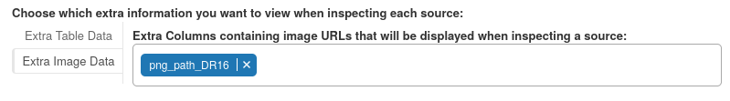

.. _settings:
Completing the Data Setup
-----------------------------------

Choosing your mode
***********************

When you first open AstronomicAL, you are given the option to enter Labelling mode or Active Learning mode. This choice determines the main screen shown after assigning settings. Both modes will allow you to assign all your required settings.

Once the settings have been completed, you can save your choices to a configuration file using the **Save Current Configuration** button at the top of the dashboard. You can then restart the software and load the configuration file in the other mode when required.

Loading your dataset
***********************

The first step is to load in your dataset. All files within the :code:`data/` directory will be selectable. If you have files in a different directory, creating a symlink/shortcut to your file inside :code:`data/` will suffice.

To begin with, we are going to load in the :code:`example_dataset.fits` file.

.. note::
  The **Optimise for memory** option allows the user to reduce the overall memory consumption of the dataset; however, this will increase the time it takes to load in the file and delay the user from progressing to the next stage. The more columns you have in your dataset, the more significant the overall improvement on memory; however, this also results in the most extended loading times.

Assigning Parameters
**********************

To make AstronomicAL as accessible as possible, there are very few requirements on columns. Where there are requirements, the user can specify the corresponding columns in the following dropdowns.

When the user chooses their labels column, the UI will autofill extra options for each unique label.

Each label can have a unique colour assigned and a custom string identifier, all of which will be used throughout the UI.

For this classification task, we have assigned Unknown, Star, Galaxy and QSO labels.

Extra Information Columns
#############################

Finally, we can specify which column values we would like to be displayed when inspecting a queried source. These extra bits of information can be especially useful when you have missing data that can't be trained on accurately but would improve the confidence in a classification if a source has the information available. Although this extra information remains unseen by the model, you can inject this information into the training process by labelling the data based on all the available information rather than just the features the model sees.

Here we want to see :code:`redshift` as the distance of an object can be very informative for its classification, as well as :code:`Lx` (X-ray luminosity) a feature only around 10% of our data has but is often the deciding factor on an object's classification. When a data point has this value available, we must see it.

Images can provide invaluable information that is often left out when only relying on trainable features. Each image column should contain either web addresses or local paths to the corresponding image for each data point (when available).

To summarise, our final parameter assignment settings look like the following:

Active Learning Settings
*************************

At first sight, the Active Learning settings panel looks a little overwhelming, but we will go through each part to ensure you can tune your models precisely as needed.

.. raw:: html

   

Selecting the Classifiers
##################################

The first step is to decide which classifiers we require to train. Currently, AstronomicAL produces a separate one-vs-rest classifier for each label as we have found this often produces more accurate predictions than a single multiclass classifier.

.. raw:: html

   

We are also given four options, all of which could have significant implications on each models performance.

Should Remaining Labels be Removed from Active Learning Datasets?
~~~~~~~~~~~~~~~~~~~~~~~~~~~~~~~~~~~~~~~~~~~~~~~~~~~~~~~~~~~~~~~~~~~
If you choose not to create a classifier for a particular label (by leaving it in the left column above), this option decides whether data with the left-out label should be removed from the training, validation, and test sets.

.. note::

  Selecting this option will only remove the data that gets inputted into the Active Learning process. The full dataset, including plots, will still contain all the data regardless of whether this option has been selected or not.

Should Features be scaled?
~~~~~~~~~~~~~~~~~~~~~~~~~~~~~~~~~~~~~~~~~~~~~~~~~~~~~~~~~~~~~~~~~~~
In many cases scaling your data can be effective at improving model performance. All data given to the Active Learning models will be scaled according to the training set when this option is selected.

The system handles this scaling; however, **if selected, the user must scale any new data they want predictions from according to the original training data**. For this reason, during the training process, AstronomicAL will save the scaler produced alongside the current model.

Should :code:`data/test_set.json` be used as the test set?
~~~~~~~~~~~~~~~~~~~~~~~~~~~~~~~~~~~~~~~~~~~~~~~~~~~~~~~~~~~~~~~~~~~
This allows you to use your hand-labelled points from :ref:`labelling mode <labelling>` as a test set. Such a test set ensures that you have reliable ground truth for which to test your model. If your model performs well on this set, you can be confident in its robustness and its generalisability to future data.

When selected, all data points included in this set are assigned as the test set; all remaining data points are then shared amongst the training and test sets.

When this option is not selected, the data is split into training, validation and test sets randomly (stratified sampling is used to ensure each set has an equal share of labels). As discussed in :ref:`Preparing your data <preparing-data>`, all unknown labels are also assigned to the training set.

As we have yet to use labelling mode in this example, we haven't created a curated test set, so this option remains disabled.

.. raw:: html

  

Selecting Your features
#################################################

Given that your fits files will likely contain many more columns than those you require for training, you must select which columns will become your features in your model.

In this example, our base features will be photometry bands :code:`u`-:code:`W2`.

.. note::

	If you want to train on features that are combinations of each other, for example, when creating colours with photometry data, you don't need to include them in your fits file. The only features you need to include are base features that cannot be created from the combination of any other features.

.. raw:: html

   

Creating Feature Combinations
#####################################

The next step is to create any of the feature combinations we require. By default, AstronomicAL allows you to add, subtract, multiply and divide any :code:`n` features. For instructions on how to create custom feature combination functions, see :ref:`here<custom_features>`.

.. image:: ../../images/feature_combinations.png

.. caution::

	To find all the combinations of :math:`r` features of out all your baseline features of size :math:`n`, the following equation is used:
  .. math::

    \frac{n!}{r!(n-r)!}

  This quickly results in a huge number of additional features as :math:`r` and :math:`n` get larger. Please bear this in mind when adding these features, as this can increase training times substantially and have a negative impact on the performance of the dashboard.

.. note::

	Even though subtraction and division are not commutative or associative, we thought it was useful to the user to have the option to apply these operations to more than two features, especially when :ref:`creating a custom feature generation function<custom_features>`.

For all the combinations you add, which are displayed to you on the right-hand side of the row, all of the produced features will be available in both the Active Learning data as well as being plottable in the basic plot.

In this run, we have generated the colours from the photometric bands we chose earlier.

.. _choosing-default-axis-variables:
Choosing Default Axis Variables
#######################################

Next, we must assign the default x and y-axis variables. The columns chosen will become our default axes for many of the Active Learning plots, as well as being the opening axes in the :code:`basic plot`.

The list of axes available automatically updates to include any of the generated features from your feature combination list. Here we have chosen :code:`g-j` and :code:`y-w1` as our default axes, both of which were generated from the subtract operation we selected above.

.. raw:: html

And this brings us to the end of the settings panel. We are now presented with a close button that will initialise either the labelling panel or active learning panel depending on your chosen mode at the beginning.

.. raw:: html

   

.. image:: ../../images/training_tutorial_settings_assign_params_20.png
