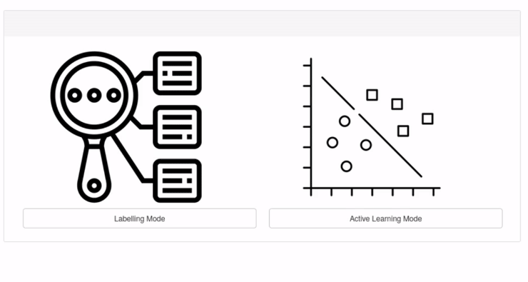

Welcome to AstronomicAL's documentation!
========================================
An interactive dashboard for visualisation, integration and classification of data using Active Learning.
--------------------------------------------------------------------

.. image:: https://travis-ci.com/grant-m-s/astronomicAL.svg?token=upRGxrMseZqj7kT3bSGx&branch=master
    :target: https://travis-ci.com/grant-m-s/astronomicAL

.. image:: https://codecov.io/gh/grant-m-s/astronomicAL/branch/master/graph/badge.svg?token=TCO9J2AD1Z
    :target: https://codecov.io/gh/grant-m-s/astronomicAL

.. image:: https://readthedocs.org/projects/astronomical/badge/?version=latest
    :target: https://astronomical.readthedocs.io

AstronomicAL is a human-in-the-loop interactive labelling and training dashboard that allows users to create reliable datasets and robust classifiers using active learning. The system enables users to visualise and integrate data from different sources and deal with incorrect or missing labels and imbalanced class sizes by using active learning to help the user focus on correcting the labels of a few key examples. Combining the use of the Panel_, Bokeh_, modAL_ and `SciKit Learn`_ packages, AstronomicAL enables researchers to take full advantage of the benefits of active learning: high accuracy models using just a fraction of the total data, without the requirement of being well versed in underlying libraries.

.. _Panel: https://panel.holoviz.org/
.. _Bokeh: https://docs.bokeh.org/en/latest/index.html
.. _modAL: https://github.com/modAL-python/modAL
.. _`SciKit Learn`: https://scikit-learn.org/stable/

.. figure:: images/AstronomicAL_demo.gif

Statement of Need
*****************
With ever-growing datasets, it is becoming impossible to manually inspect and verify ground truth used to train machine learning systems. The reliability of the training data limits the performance of any supervised learning model, so consistent classifications become more problematic as data sizes increase. The problem is exacerbated when a dataset does not contain any labelled data, preventing supervised learning techniques entirely. Active learning `(Settles, 2012)`_ addresses these issues by removing the requirement for large amounts of labelled training data whilst still producing high accuracy models.

Although initially designed for astronomers, by providing the functionality for data fusion of catalogued data and online cutout services, AstronomicAL has been developed to be sufficiently general for any tabular data. Large datasets, unreliable labels and vastly imbalanced classes make astronomy data the ideal vehicle to develop this software. Each of these issues is an examplar of more generalised problems that active learning could solve in any dataset.

Using its modular and extensible design, researchers can quickly adapt AstronomicAL for their research to allow for domain-specific plots, novel query strategies, and improved models. Further, there is no requirement to be well-versed in the underlying libraries that the software uses as large parts of the complexity are abstracted whilst still allowing more experienced users to access full customisability.

As the software runs entirely locally on the user’s system, AstronomicAL provides a private space to experiment whilst providing a public mechanism to share results. By sharing only the configuration file, users remain in charge of distributing their potentially sensitive data, enabling collaboration whilst respecting privacy.

.. _`(Settles, 2012)`: https://www.morganclaypool.com/doi/abs/10.2200/S00429ED1V01Y201207AIM018

Installation
------------------
To install AstronomicAL and its dependencies, the user can clone the repository and from within the repo folder run :code:`pip install -r requirements.txt`. It is recommended that the user creates a virtual environment using tools such as Virtualenv_ or Conda_, to prevent any conflicting package versions.

.. code-block:: bash

    git clone https://github.com/grant-m-s/AstronomicAL.git
    cd AstronomicAL
    conda config --add channels conda-forge
    conda create --name astronomical --file requirements.txt
    conda activate astronomical

.. _Virtualenv: https://packaging.python.org/guides/installing-using-pip-and-virtual-environments/#installing-virtualenv
.. _Conda: https://docs.conda.io/projects/conda/en/latest/user-guide/tasks/manage-environments.html

Quickstart Instructions
-----------------------
To begin using the software, run :code:`bokeh serve astronomicAL --show`, and your browser should automatically open to `localhost:5006/astronomicAL
<localhost:5006/astronomicAL>`_.

AstronomicAL provides an example dataset and an example configuration file to allow you to jump right into the software and give it a test run.

    AstronomicAL makes it easy to start training your classifier or reload a previous checkpoint.

To begin training, you simply have to select **Load Custom Configuration** checkbox and select your config file. Here we have chosen to use the :code:`example_config.json` file.

The **Load Config Select** option allows users to choose the extent to which to reload the configuration.

.. raw:: html

   

Contributing to AstronomicAL
-------------------------

Reporting Bugs
*****************

If you encounter a bug, you can directly report it in the `issues section <https://github.com/grant-m-s/AstronomicAL/issues>`_.

Please describe how to reproduce the bug and include as much information as possible that can be helpful for fixing it.

**Are you able to fix a bug?**

You can open a new pull request or include your suggested fix in the issue.

Submission of extensions
*****************

**Have you created an extension that you want to share with the community?**

Create a pull request describing your extension and how it can improve research for others.

Support and Feedback
*****************

We would love to hear your thoughts on AstronomicAL.

Are there any features that would improve the effectiveness and usability of AstronomicAL? Let us know!

Any feedback can be submitted as an `issue <https://github.com/grant-m-s/AstronomicAL/issues>`_.

.. raw:: html

   

Referencing the Package
-------------------------

Please remember to cite our software and user guide whenever relevant.

See the :ref:`citing <citing>` page for instructions about referencing and citing the AstronomicAL software.

.. raw:: html

   

.. toctree::
   :maxdepth: 2
   :caption: Contents:

.. toctree::
    :glob:
    :maxdepth: 1
    :caption: API reference

    content/apireference/active_learning.rst
    content/apireference/dashboard.rst
    .. content/apireference/extensions.rst
    content/apireference/settings.rst
    .. content/apireference/utils.rst

.. toctree::
    :maxdepth: 1
    :caption: Tutorials

    content/tutorials/preparing_dataset.rst
    content/tutorials/settings.rst
    content/tutorials/active_learning.rst
    content/tutorials/reload_config.rst
    content/tutorials/labelling_test_set.rst
    content/tutorials/plots.rst
    content/tutorials/feature_generation.rst
    content/tutorials/using_model.rst

.. toctree::
    :maxdepth: 1
    :caption: Other

    content/other/contributors.rst
    content/other/citing.rst

Indices and tables
==================

* :ref:`genindex`
* :ref:`modindex`
* :ref:`search`

.. image:: images/EPSRC+logo.png
   :width: 56%
   :target: https://gtr.ukri.org/projects?ref=studentship-2466020
